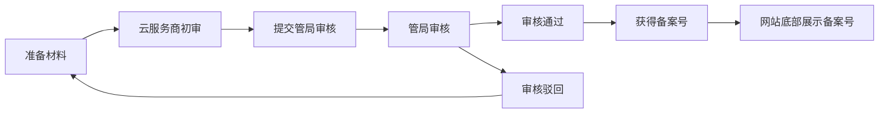
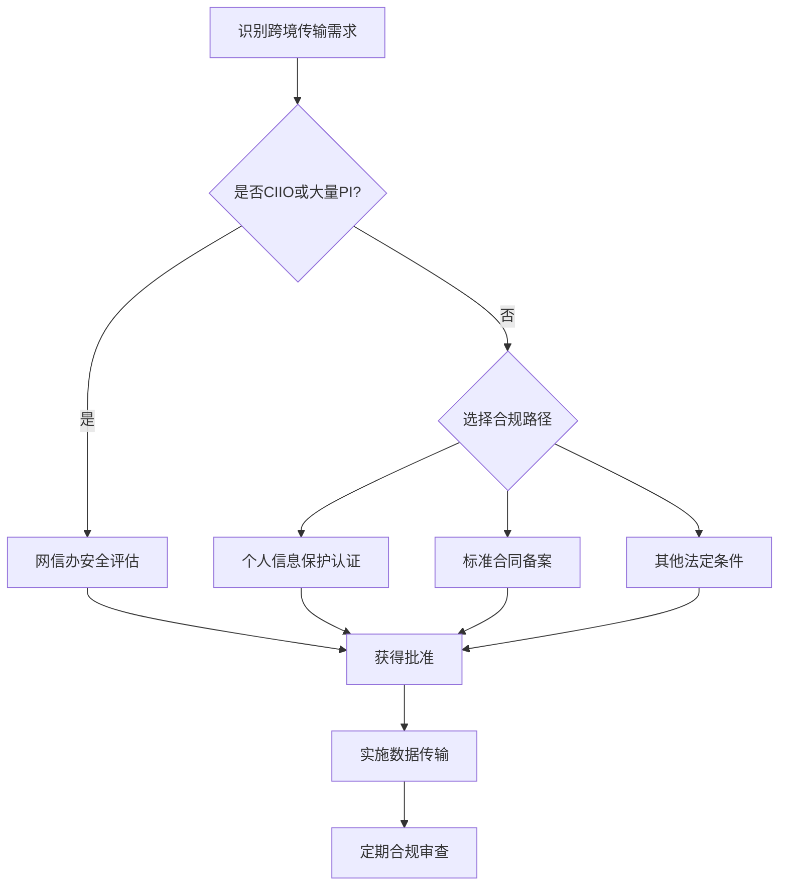
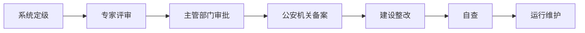

# 中国合规检查清单 (China Compliance Checklist)

本文档提供在中国大陆运营互联网应用所需的合规要求和检查清单。确保您的应用满足中国法律法规和监管要求。

> **📋 相关文档**:
>
> - [隐私政策模板](./compliance/PRIVACY_POLICY_TEMPLATE.md)
> - [Cookie同意模板](./compliance/COOKIE_CONSENT_TEMPLATE.md)
> - [生产环境检查清单](./PRODUCTION_CHECKLIST.md)
> - [部署指南](./DEPLOYMENT.md)

## 📖 目录

- [法律法规概述](#法律法规概述)
- [ICP备案要求](#icp备案要求)
- [数据驻留与跨境传输](#数据驻留与跨境传输)
- [个人信息保护](#个人信息保护)
- [网络安全等级保护](#网络安全等级保护)
- [Cookie与追踪技术](#cookie与追踪技术)
- [内容合规](#内容合规)
- [技术实施要点](#技术实施要点)
- [合规审核清单](#合规审核清单)

---

## 法律法规概述

### 主要法律法规

#### 1. 网络安全法 (Cybersecurity Law - CSL)

- **生效日期**: 2017年6月1日
- **适用范围**: 所有在中国运营的网络运营者
- **关键要求**:
  - 网络安全等级保护制度
  - 实名制认证
  - 关键信息基础设施保护
  - 数据本地化存储

#### 2. 数据安全法 (Data Security Law - DSL)

- **生效日期**: 2021年9月1日
- **适用范围**: 所有在中国境内收集、存储、使用、处理数据的组织
- **关键要求**:
  - 数据分类分级保护
  - 数据安全风险评估
  - 重要数据和核心数据保护

#### 3. 个人信息保护法 (Personal Information Protection Law - PIPL)

- **生效日期**: 2021年11月1日
- **适用范围**: 所有处理个人信息的组织
- **关键要求**:
  - 明确告知和同意机制
  - 个人信息处理者义务
  - 用户权利保障（访问、更正、删除）
  - 敏感个人信息特殊保护

#### 4. 互联网信息服务管理办法

- **要求**: ICP备案/许可证
- **分类**:
  - **ICP备案**: 非经营性网站
  - **ICP许可证**: 经营性网站

### 监管机构

- **国家互联网信息办公室 (CAC)**: 网络安全和信息内容管理
- **工业和信息化部 (MIIT)**: ICP备案管理
- **公安部**: 网络安全等级保护
- **国家市场监督管理总局**: 数据安全和个人信息保护执法

---

## ICP备案要求

### 备案类型判断

#### 非经营性网站 - ICP备案

- [ ] 纯信息展示网站
- [ ] 企业官网
- [ ] 个人博客
- [ ] 不涉及商业交易的应用

**流程**: 通过云服务商提交备案申请 → 管局审核（7-20个工作日）

#### 经营性网站 - ICP许可证

- [ ] 在线销售商品或服务
- [ ] 收取费用的会员服务
- [ ] 广告展示获取收益
- [ ] 在线交易平台

**流程**: 先完成ICP备案 → 向省通信管理局申请ICP许可证（60-90个工作日）

### ICP备案准备材料

#### 企业备案

- [ ] 营业执照副本扫描件
- [ ] 法人身份证正反面扫描件
- [ ] 网站负责人身份证正反面扫描件
- [ ] 网站负责人手持身份证照片
- [ ] 域名证书
- [ ] 《网站备案信息真实性核验单》（加盖公章）
- [ ] 《网络安全责任书》（部分地区要求）
- [ ] 服务器接入商信息

#### 个人备案

- [ ] 个人身份证正反面扫描件
- [ ] 手持身份证照片
- [ ] 域名证书
- [ ] 《网站备案信息真实性核验单》

### 备案流程



#### 详细步骤

1. **选择接入商**
   - 阿里云、腾讯云、华为云等
   - 确保服务器在中国大陆

2. **填写备案信息**
   - 主体信息（企业或个人）
   - 网站信息（域名、IP地址）
   - 网站负责人信息

3. **上传证件材料**
   - 按要求上传清晰的扫描件或照片

4. **接入商初审**
   - 1-3个工作日
   - 检查材料完整性和准确性

5. **提交管局审核**
   - 接入商提交至省通信管理局

6. **管局审核**
   - 7-20个工作日
   - 可能电话核实信息

7. **获得备案号**
   - 格式: 省简称ICP备XXXXXXXX号
   - 例如: 京ICP备12345678号

### 备案后维护

- [ ] **网站底部展示备案号**

  ```html
  <footer>
    <a href="https://beian.miit.gov.cn/" target="_blank" rel="noopener"> 京ICP备12345678号-1 </a>
  </footer>
  ```

- [ ] **公安备案**（网站开通后30日内）
  - 访问 [全国公安机关互联网站安全管理服务平台](http://www.beian.gov.cn/)
  - 填写网站信息和服务器信息
  - 获得公安备案号
  - 在网站底部展示公安备案号和图标

  ```html
  <footer>
    <a href="http://www.beian.gov.cn/portal/registerSystemInfo" target="_blank">
      
      京公网安备 11010502012345号
    </a>
  </footer>
  ```

- [ ] **备案信息变更**
  - 公司名称变更
  - 网站负责人变更
  - 域名增加/减少
  - 及时通过接入商提交变更申请

- [ ] **域名续费和备案年审**
  - 确保域名持续有效
  - 部分省份要求年审

### 特殊内容备案

根据网站内容类型，可能需要额外审批:

- [ ] **新闻资讯**: 互联网新闻信息服务许可证
- [ ] **视频直播**: 网络文化经营许可证、信息网络传播视听节目许可证
- [ ] **在线教育**: 在线教育服务ICP备案（教育类目）
- [ ] **电商平台**: ICP许可证、EDI许可证
- [ ] **论坛社区**: 专项备案或前置审批
- [ ] **医疗健康**: 互联网医疗保健信息服务许可
- [ ] **金融服务**: 相关金融牌照

---

## 数据驻留与跨境传输

### 数据本地化要求

#### 关键信息基础设施运营者 (CIIO)

- [ ] 确认是否属于CIIO（金融、通信、能源、交通等关键行业）
- [ ] **强制要求**: 在中国境内收集和产生的个人信息和重要数据必须存储在境内

#### 一般网络运营者

- [ ] 评估是否处理大量个人信息（超过100万人）
- [ ] 如超过阈值，需遵守数据本地化要求

### 数据跨境传输评估

如需将数据传输到境外，必须满足以下条件之一:

#### 1. 网信办安全评估

- [ ] 适用场景:
  - CIIO向境外提供数据
  - 处理100万人以上个人信息向境外提供
  - 累计向境外提供超过10万人个人信息或1万人敏感个人信息
- [ ] 评估内容:
  - 数据出境风险
  - 接收方处理能力
  - 数据安全保护措施

#### 2. 个人信息保护认证

- [ ] 通过国家网信部门认可的专业机构认证

#### 3. 标准合同

- [ ] 签署网信办发布的标准合同
- [ ] 明确双方权利义务和责任
- [ ] 报省级网信办备案

#### 4. 其他法律法规规定的条件

### 技术实施清单

- [ ] **数据存储位置审查**

  ```bash
  # 检查数据库服务器位置
  # PostgreSQL示例
  DATABASE_HOST=cn-beijing.rds.aliyuncs.com
  DATABASE_REGION=cn-beijing
  ```

- [ ] **云服务商选择**
  - 阿里云（推荐：中国大陆节点）
  - 腾讯云（推荐：中国大陆节点）
  - 华为云（推荐：中国大陆节点）
  - 避免使用AWS、Google Cloud、Azure海外节点

- [ ] **CDN配置审查**
  - 确保静态资源CDN节点在中国境内
  - 推荐: 阿里云CDN、腾讯云CDN、网宿CDN

- [ ] **第三方服务审查**
  - 列出所有使用的第三方API和服务
  - 确认数据流向和存储位置
  - 评估是否涉及跨境传输

- [ ] **数据分类清单**

  ```typescript
  // 数据分类示例
  enum DataClassification {
    PUBLIC = 'public', // 公开数据
    INTERNAL = 'internal', // 内部数据
    CONFIDENTIAL = 'confidential', // 机密数据
    SENSITIVE = 'sensitive', // 敏感个人信息
  }

  // 个人信息分类
  enum PersonalInfoType {
    BASIC = 'basic', // 基本个人信息（姓名、电话、邮箱）
    SENSITIVE = 'sensitive', // 敏感个人信息（身份证号、生物识别、金融账户）
    MINOR = 'minor', // 未成年人信息
  }
  ```

- [ ] **数据流向图**
  - 绘制数据在系统中的完整流向
  - 标注数据存储位置和跨境传输点
  - 定期审核更新

### 跨境传输合规流程

如确需跨境传输，按以下流程操作:



---

## 个人信息保护

### PIPL核心原则

1. **合法、正当、必要和诚信原则**
2. **目的明确原则**
3. **最小必要原则**
4. **公开透明原则**
5. **数据质量原则**
6. **责任原则**

### 告知同意机制

#### 隐私政策要求

- [ ] **明确、易懂的语言**
  - 避免法律术语和专业术语
  - 使用短句和分段
  - 提供目录和章节

- [ ] **必须包含的内容**:
  1. 处理者身份和联系方式
  2. 处理目的、方式
  3. 处理的个人信息种类
  4. 保存期限
  5. 个人行使权利的方式和途径
  6. 第三方共享情况
  7. 跨境传输情况
  8. 投诉和举报渠道

- [ ] **展示位置**
  - 首页底部链接
  - 注册/登录页面明显位置
  - 首次使用应用时弹窗提示
  - App Store/应用商店描述页

- [ ] **版本管理**
  - 每次重大变更需重新获得用户同意
  - 保留历史版本记录
  - 变更时提前通知用户（通常30天）

#### 同意获取要求

- [ ] **明示同意**
  - 不能使用默认勾选
  - 必须用户主动勾选或点击同意
  - 示例:
    ```html
    <input type="checkbox" id="privacy-consent" name="privacy-consent" required />
    <label for="privacy-consent"> 我已阅读并同意 <a href="/privacy-policy">隐私政策</a> </label>
    ```

- [ ] **单独同意**（敏感个人信息）
  - 身份证号、生物识别信息
  - 医疗健康、金融账户信息
  - 行踪轨迹、宗教信仰
  - 不满十四周岁未成年人的个人信息

  ```html
  <input type="checkbox" id="sensitive-consent" name="sensitive-consent" />
  <label for="sensitive-consent"> 我同意处理我的敏感个人信息（身份证号）用于实名认证 </label>
  ```

- [ ] **撤回同意机制**
  - 提供便捷的撤回途径
  - 撤回操作不得比同意操作复杂
  - 实施示例:
    ```vue
    <button @click="revokeConsent">撤回隐私同意</button>
    ```

### 用户权利保障

#### 1. 知情权

- [ ] 随时查看隐私政策
- [ ] 了解个人信息处理情况

#### 2. 决定权

- [ ] 同意或拒绝个人信息处理
- [ ] 授权第三方处理

#### 3. 查询和复制权

- [ ] **实施要求**: 提供个人信息导出功能
- [ ] **响应时间**: 15个工作日内
- [ ] **实现示例**:
  ```vue
  <!-- 个人信息导出功能 -->
  <button @click="exportPersonalData">
    导出我的个人信息
  </button>
  ```

#### 4. 更正和补充权

- [ ] 提供信息编辑功能
- [ ] 及时更新错误信息

#### 5. 删除权

- [ ] **触发条件**:
  - 处理目的已实现
  - 停止提供产品或服务
  - 用户撤回同意
  - 违反法律法规
- [ ] **实施要求**: 15个工作日内响应
- [ ] **技术实现**:
  ```typescript
  // 账户删除API
  async function deleteAccount(userId: string) {
    // 1. 标记账户为待删除
    await markAccountForDeletion(userId)

    // 2. 30天冷静期
    const deleteDate = new Date()
    deleteDate.setDate(deleteDate.getDate() + 30)

    // 3. 匿名化或删除个人信息
    await anonymizePersonalInfo(userId)

    // 4. 保留必要记录（法律要求）
    await retainLegalRecords(userId)
  }
  ```

#### 6. 解释说明权

- [ ] 提供个人信息处理规则的解释
- [ ] 建立客服或支持渠道

#### 7. 可携带权

- [ ] 允许用户获取个人信息副本
- [ ] 提供通用格式（JSON、CSV）

### 未成年人保护

- [ ] **不满十四周岁**: 必须取得监护人同意
- [ ] **年龄验证机制**
  ```typescript
  // 年龄验证示例
  function requireParentalConsent(birthDate: Date): boolean {
    const age = calculateAge(birthDate)
    return age < 14
  }
  ```
- [ ] **监护人同意方式**:
  - 监护人账号授权
  - 监护人身份验证
  - 联系电话验证

- [ ] **未成年人专门隐私政策**
  - 使用简单语言
  - 说明如何获得监护人同意

### 个人信息安全

#### 技术措施

- [ ] **传输加密**: HTTPS/TLS 1.2+
- [ ] **存储加密**:
  - 敏感信息加密存储
  - 密码哈希（bcrypt、Argon2）
- [ ] **访问控制**:
  - 基于角色的权限控制（RBAC）
  - 最小权限原则
- [ ] **审计日志**:
  - 记录个人信息访问和处理操作
  - 日志保存至少6个月

#### 组织措施

- [ ] **指定个人信息保护负责人**
  - 姓名和联系方式在隐私政策中公开
- [ ] **员工培训**
  - 定期数据保护和隐私培训
  - 签署保密协议
- [ ] **内部管理制度**
  - 个人信息保护管理规定
  - 数据安全事件应急预案

### 个人信息泄露应对

- [ ] **通知义务**:
  - **监管部门**: 立即通知（通常24小时内）
  - **个人**: 可能造成损害时通知

- [ ] **通知内容**:
  - 泄露情况和影响
  - 已采取的补救措施
  - 个人可采取的措施
  - 联系方式

- [ ] **应急预案**:
  ```markdown
  ## 数据泄露应急流程

  1. 发现/接报 → 2小时内启动应急响应
  2. 评估影响范围和严重程度
  3. 采取技术措施遏制泄露
  4. 通知监管部门（24小时内）
  5. 通知受影响用户（48小时内）
  6. 根本原因分析
  7. 整改措施和预防机制
  8. 事件总结报告
  ```

---

## 网络安全等级保护

### 等级保护制度 (Multi-Level Protection Scheme - MLPS)

#### 等级划分

| 等级     | 名称       | 适用对象                       | 要求          |
| -------- | ---------- | ------------------------------ | ------------- |
| **一级** | 自主保护级 | 一般小型网站                   | 自主保护      |
| **二级** | 指导保护级 | 一般企业网站、小型应用         | **备案**      |
| **三级** | 监督保护级 | 重要业务系统、涉及大量用户信息 | **备案+测评** |
| **四级** | 强制保护级 | 关键信息基础设施               | 强制保护      |
| **五级** | 专控保护级 | 国家核心系统                   | 专控保护      |

#### 等级判断标准

**二级系统**（大多数应用适用）:

- [ ] 注册用户 < 10万
- [ ] 业务中断影响较小
- [ ] 个人信息量中等

**三级系统**:

- [ ] 注册用户 ≥ 10万
- [ ] 涉及重要业务（金融交易、在线教育、医疗健康）
- [ ] 业务中断对公共利益造成严重损害
- [ ] 处理大量个人信息或敏感信息

### 二级等保合规流程



#### 1. 系统定级

- [ ] 确定系统安全保护等级（通常为二级）
- [ ] 编写《定级报告》

#### 2. 专家评审

- [ ] 组织不少于5名专家评审定级
- [ ] 专家出具评审意见

#### 3. 主管部门审批

- [ ] 提交主管单位审核批准

#### 4. 公安机关备案

- [ ] 携带备案材料到当地公安网监部门
- [ ] 材料:
  - 定级报告
  - 专家评审意见
  - 主管部门审批文件
  - 系统拓扑图
- [ ] 获得《备案证明》

#### 5. 建设整改

- [ ] 按照等保要求进行安全建设
- [ ] 配置安全设备和措施

#### 6. 自查

- [ ] 完成内部安全自查
- [ ] 确保符合等保要求

#### 7. 运行维护

- [ ] 持续安全运维
- [ ] 定期安全检查

### 三级等保合规流程

在二级基础上增加:

#### 8. 等级测评

- [ ] 选择有资质的测评机构
- [ ] 进行等级测评（每年至少一次）
- [ ] 获得《等级测评报告》
- [ ] 测评分数 ≥ 75分（基本符合）

#### 9. 整改

- [ ] 根据测评报告整改
- [ ] 完成风险项处理

### 技术要求清单

#### 二级系统技术要求

**物理安全**

- [ ] 机房访问控制
- [ ] 防火、防水、防盗措施
- [ ] 温湿度控制
- [ ] 电力供应（UPS）

**网络安全**

- [ ] 网络边界防护（防火墙）
- [ ] 访问控制策略
- [ ] 入侵检测（可选）
- [ ] 恶意代码防范

**主机安全**

- [ ] 操作系统安全加固
- [ ] 身份鉴别
- [ ] 访问控制
- [ ] 安全审计
- [ ] 防病毒软件

**应用安全**

- [ ] 用户身份鉴别
- [ ] 访问控制
- [ ] 安全审计
- [ ] 剩余信息保护
- [ ] 通信完整性和保密性（HTTPS）

**数据安全**

- [ ] 数据备份与恢复
- [ ] 数据完整性
- [ ] 数据保密性（加密存储）

**安全管理**

- [ ] 安全管理制度
- [ ] 安全管理机构
- [ ] 人员安全管理
- [ ] 系统建设管理
- [ ] 系统运维管理

#### 三级系统额外要求

- [ ] **网络安全**:
  - 入侵检测系统（IDS）
  - 入侵防御系统（IPS）
  - 网络审计
  - 网络冗余和负载均衡

- [ ] **主机安全**:
  - 主机入侵检测（HIDS）
  - 可信验证

- [ ] **应用安全**:
  - 代码审计
  - 渗透测试

- [ ] **数据安全**:
  - 数据容灾备份
  - 备份异地存储

---

## Cookie与追踪技术

### Cookie使用合规

根据PIPL和其他相关法规，使用Cookie需遵守以下要求:

#### 1. 分类管理

- [ ] **必要Cookie**（无需同意）:
  - 身份验证
  - 安全防护
  - 保持用户会话

- [ ] **功能性Cookie**（需同意）:
  - 用户偏好设置
  - 语言选择
  - 界面定制

- [ ] **分析/性能Cookie**（需同意）:
  - 网站分析（Google Analytics、百度统计）
  - 性能监控
  - A/B测试

- [ ] **广告/营销Cookie**（需单独同意）:
  - 广告投放
  - 再营销
  - 用户画像

#### 2. Cookie政策

- [ ] **制定Cookie政策文档**
  - 参考: [Cookie同意模板](./compliance/COOKIE_CONSENT_TEMPLATE.md)
- [ ] **Cookie政策内容**:
  1. 什么是Cookie
  2. 使用的Cookie类型
  3. Cookie用途
  4. 第三方Cookie说明
  5. 如何管理Cookie

- [ ] **展示位置**:
  - 隐私政策中单独章节
  - 首次访问时显示Cookie横幅

#### 3. Cookie同意机制

- [ ] **首次访问提示**:
  - 页面加载时显示Cookie横幅
  - 不能使用"继续浏览即同意"的方式
  - 必须有明确的接受/拒绝按钮

- [ ] **同意选项**:
  - 全部接受
  - 全部拒绝
  - 自定义设置（按类别选择）

- [ ] **同意记录**:
  - 记录用户同意的时间和选项
  - 保存同意记录至少6个月

- [ ] **撤回机制**:
  - 提供便捷的Cookie设置页面
  - 允许随时更改Cookie偏好

#### 4. 技术实现指引

参考以下实现方案:

**前端Cookie横幅组件**:

```vue
<!-- apps/frontend/components/CookieConsent.vue -->
<template>
  <div v-if="showBanner" class="cookie-consent-banner">
    <div class="cookie-consent-content">
      <h3>Cookie使用提示</h3>
      <p>
        我们使用Cookie来提升您的浏览体验。
        <a href="/privacy-policy#cookies" target="_blank">了解更多</a>
      </p>
      <div class="cookie-consent-actions">
        <button @click="acceptAll">接受所有Cookie</button>
        <button @click="rejectNonEssential">仅接受必要Cookie</button>
        <button @click="showSettings">Cookie设置</button>
      </div>
    </div>
  </div>
</template>

<script setup lang="ts">
// TODO: 实现Cookie同意逻辑
// 参考: docs/compliance/COOKIE_CONSENT_TEMPLATE.md
</script>
```

**Cookie管理工具类**:

```typescript
// apps/frontend/utils/cookieConsent.ts
// TODO: 实现Cookie分类管理
// - 必要Cookie: 始终允许
// - 功能性Cookie: 用户选择
// - 分析Cookie: 用户选择
// - 广告Cookie: 用户选择

export enum CookieCategory {
  NECESSARY = 'necessary',
  FUNCTIONAL = 'functional',
  ANALYTICS = 'analytics',
  ADVERTISING = 'advertising',
}

export interface CookieConsent {
  timestamp: Date
  necessary: boolean // 始终为true
  functional: boolean
  analytics: boolean
  advertising: boolean
}

// TODO: 实现以下功能
// - getCookieConsent(): 获取当前同意状态
// - setCookieConsent(consent: CookieConsent): 保存同意状态
// - hasConsent(category: CookieCategory): 检查是否同意特定类别
// - clearNonConsentedCookies(): 清除未同意类别的Cookie
```

**环境变量配置**:

```bash
# .env
# Cookie和跟踪合规配置
NUXT_PUBLIC_COOKIE_CONSENT_ENABLED=true
NUXT_PUBLIC_ANALYTICS_ENABLED=false  # 默认禁用，用户同意后启用
NUXT_PUBLIC_ADVERTISING_ENABLED=false
```

#### 5. 第三方Cookie审查

- [ ] **列出所有第三方Cookie**:
  - Google Analytics / 百度统计
  - 社交媒体插件（微信、微博分享）
  - 广告网络
  - CDN服务

- [ ] **评估必要性**:
  - 是否可替换为第一方解决方案
  - 是否可延迟加载直到用户同意

- [ ] **数据处理协议**:
  - 与第三方签署数据处理协议
  - 确保第三方符合PIPL要求

### 其他追踪技术

除Cookie外，还需注意:

- [ ] **本地存储 (LocalStorage/SessionStorage)**
  - 同样需要用户同意（除必要功能外）
  - 说明存储的数据类型和用途

- [ ] **设备指纹**
  - 如用于跟踪用户，需明确告知和同意
  - 不能用于规避Cookie限制

- [ ] **像素标签和信标**
  - 用于分析和广告时需要同意
  - 在隐私政策中说明

---

## 内容合规

### 禁止和限制内容

根据《网络安全法》、《网络信息内容生态治理规定》等法规:

#### 禁止内容

- [ ] 反对宪法确定的基本原则
- [ ] 危害国家安全、泄露国家秘密
- [ ] 颠覆国家政权、推翻社会主义制度
- [ ] 分裂国家、破坏国家统一
- [ ] 损害国家荣誉和利益
- [ ] 宣扬恐怖主义、极端主义
- [ ] 宣扬民族仇恨、民族歧视
- [ ] 煽动社会动乱
- [ ] 破坏国家宗教政策、宣扬邪教和封建迷信
- [ ] 散布谣言、扰乱经济社会秩序
- [ ] 淫秽、色情、赌博、暴力、凶杀、恐怖内容
- [ ] 侮辱或者诽谤他人
- [ ] 侵害他人知识产权
- [ ] 其他违反法律法规的内容

#### 内容审核机制

- [ ] **用户生成内容(UGC)审核**:
  - 先审后发（推荐）或发后审
  - 关键词过滤
  - 图片识别（涉黄、涉恐、涉政）
  - 人工复审

- [ ] **审核工具**:
  - 阿里云内容安全
  - 腾讯云天御
  - 网易易盾

- [ ] **举报机制**:
  - 提供明显的举报入口
  - 及时处理举报内容

### 实名制要求

某些服务需要实行实名制:

- [ ] **论坛、社区、评论区**
  - 后台实名、前台可匿名
  - 手机号验证

- [ ] **直播、短视频**
  - 主播实名认证
  - 可能需要身份证验证

- [ ] **账号注册**
  - 手机号或邮箱验证
  - 重要操作二次验证

---

## 技术实施要点

### 环境变量合规配置

在 `.env` 或 `.env.example` 中添加合规相关配置:

```bash
# ===== 合规配置 (Compliance Configuration) =====

# ICP备案信息
ICP_FILING_NUMBER=京ICP备12345678号-1
PUBLIC_SECURITY_FILING_NUMBER=京公网安备 11010502012345号

# 隐私和Cookie
PRIVACY_POLICY_URL=/privacy-policy
COOKIE_POLICY_URL=/cookie-policy
COOKIE_CONSENT_ENABLED=true

# 数据驻留
DATA_RESIDENCY=CN
DATABASE_REGION=cn-beijing
CDN_REGION=cn

# 个人信息保护
PERSONAL_INFO_PROTECTION_ENABLED=true
PERSONAL_INFO_OFFICER_NAME=张三
PERSONAL_INFO_OFFICER_EMAIL=privacy@example.com
PERSONAL_INFO_OFFICER_PHONE=+86-10-12345678

# 安全等级保护
MLPS_LEVEL=2
MLPS_FILING_NUMBER=12345678901234

# 内容审核
CONTENT_MODERATION_ENABLED=true
CONTENT_MODERATION_PROVIDER=aliyun  # aliyun, tencent, netease

# 实名认证
REAL_NAME_VERIFICATION_ENABLED=false

# 未成年人保护
MINOR_PROTECTION_ENABLED=true
MIN_AGE_REQUIREMENT=14

# 日志和审计
AUDIT_LOG_ENABLED=true
AUDIT_LOG_RETENTION_DAYS=180

# 跨境数据传输
CROSS_BORDER_DATA_TRANSFER_ENABLED=false
```

### 环境变量验证脚本

创建脚本验证合规配置:

```typescript
// scripts/validate-compliance-env.ts
// TODO: 实现合规环境变量验证
// - 检查ICP备案号格式
// - 验证数据驻留区域设置
// - 确保隐私保护配置正确
// - 检查日志保留期限符合要求

export function validateComplianceEnv() {
  const errors: string[] = []

  // ICP备案检查
  if (!process.env.ICP_FILING_NUMBER) {
    errors.push('缺少ICP备案号 (ICP_FILING_NUMBER)')
  }

  // 数据驻留检查
  if (process.env.DATA_RESIDENCY !== 'CN') {
    errors.push('数据驻留地区必须设置为中国 (DATA_RESIDENCY=CN)')
  }

  // 个人信息保护负责人
  if (!process.env.PERSONAL_INFO_OFFICER_EMAIL) {
    errors.push('缺少个人信息保护负责人联系方式')
  }

  // 审计日志
  if (process.env.AUDIT_LOG_ENABLED === 'true') {
    const retention = parseInt(process.env.AUDIT_LOG_RETENTION_DAYS || '0')
    if (retention < 180) {
      errors.push('审计日志保留期限必须至少180天')
    }
  }

  return errors
}
```

### 前端实施清单

- [ ] **Cookie同意横幅**: `components/CookieConsent.vue`
- [ ] **隐私政策页面**: `pages/privacy-policy.vue`
- [ ] **Cookie政策页面**: `pages/cookie-policy.vue`
- [ ] **用户协议页面**: `pages/terms-of-service.vue`
- [ ] **个人信息导出功能**: `pages/account/export-data.vue`
- [ ] **账户删除功能**: `pages/account/delete.vue`
- [ ] **Cookie设置页面**: `pages/account/cookie-preferences.vue`
- [ ] **ICP备案号展示**: 在 `components/AppFooter.vue` 中添加

```vue
<!-- components/AppFooter.vue -->
<footer>
  <div class="footer-links">
    <a href="/privacy-policy">隐私政策</a>
    <a href="/terms-of-service">用户协议</a>
    <a href="/cookie-policy">Cookie政策</a>
  </div>
  <div class="footer-filing">
    <a href="https://beian.miit.gov.cn/" target="_blank" rel="noopener">
      {{ icpFilingNumber }}
    </a>
    <a href="http://www.beian.gov.cn/portal/registerSystemInfo" target="_blank" rel="noopener">
      
      {{ publicSecurityFilingNumber }}
    </a>
  </div>
</footer>
```

### 后端实施清单 (Strapi CMS)

- [ ] **审计日志中间件**

  ```typescript
  // apps/cms/src/middlewares/audit-log.ts
  // TODO: 记录个人信息访问和处理操作
  ```

- [ ] **数据保留策略**

  ```typescript
  // apps/cms/src/cron/data-retention.ts
  // TODO: 自动清理过期个人信息
  ```

- [ ] **个人信息导出API**

  ```typescript
  // apps/cms/src/api/user/controllers/export-data.ts
  // TODO: 实现PIPL要求的数据可携带权
  ```

- [ ] **账户删除API**

  ```typescript
  // apps/cms/src/api/user/controllers/delete-account.ts
  // TODO: 实现完整的账户和数据删除流程
  ```

- [ ] **敏感信息加密**
  ```typescript
  // apps/cms/src/utils/encryption.ts
  // TODO: 敏感个人信息加密存储
  ```

---

## 合规审核清单

### 启动前审核

#### 法律文档

- [ ] 隐私政策已发布并可访问
- [ ] Cookie政策已发布
- [ ] 用户协议已发布
- [ ] 所有政策文档为简体中文
- [ ] 政策文档包含所有法定要求内容
- [ ] 个人信息保护负责人信息已公开

#### ICP备案

- [ ] ICP备案已完成并获得备案号
- [ ] 公安备案已完成（上线后30天内）
- [ ] 备案号正确显示在网站底部
- [ ] 备案号链接到官方网站

#### 数据合规

- [ ] 确认所有数据存储在中国境内
- [ ] 数据库服务器位于中国大陆
- [ ] CDN节点主要在中国大陆
- [ ] 第三方服务数据流向已审查
- [ ] 无未经授权的跨境数据传输
- [ ] 数据分类和分级已完成

#### 个人信息保护

- [ ] 用户同意机制已实施（明示同意）
- [ ] 敏感信息单独同意机制已实施
- [ ] 未成年人保护机制已实施
- [ ] 个人信息导出功能已实现
- [ ] 账户删除功能已实现
- [ ] Cookie同意横幅已实施
- [ ] 数据加密传输和存储已配置

#### 安全措施

- [ ] HTTPS已启用
- [ ] 安全头部已配置
- [ ] 防火墙规则已配置
- [ ] 访问控制已实施
- [ ] 审计日志已启用
- [ ] 数据备份已配置
- [ ] 应急响应预案已制定

#### 等级保护

- [ ] 系统等级保护定级已完成
- [ ] 等保备案已完成（二级系统）
- [ ] 等保测评已通过（三级系统，如适用）

#### 内容合规

- [ ] 内容审核机制已实施（如有UGC）
- [ ] 关键词过滤已配置
- [ ] 举报机制已实现
- [ ] 实名制已实施（如适用）

### 运营期审核

#### 每月检查

- [ ] 审查审计日志
- [ ] 检查用户权利请求处理情况
- [ ] 审查隐私投诉和举报
- [ ] 检查数据备份完整性

#### 每季度检查

- [ ] 审查隐私政策是否需要更新
- [ ] 评估第三方服务合规性
- [ ] 检查员工培训记录
- [ ] 进行内部安全审计

#### 每年检查

- [ ] 更新风险评估
- [ ] 审查和更新应急预案
- [ ] 等保测评（三级系统）
- [ ] 全面合规审计
- [ ] ICP备案信息年审（如适用）

### 合规文档清单

维护以下合规文档:

- [ ] **隐私政策** (Privacy Policy)
- [ ] **Cookie政策** (Cookie Policy)
- [ ] **用户协议** (Terms of Service)
- [ ] **数据处理协议** (Data Processing Agreement) - 与第三方
- [ ] **个人信息保护管理制度** (Personal Information Protection Policy)
- [ ] **数据安全管理制度** (Data Security Management Policy)
- [ ] **应急响应预案** (Incident Response Plan)
- [ ] **数据分类分级指南** (Data Classification Guide)
- [ ] **员工保密协议** (Employee Confidentiality Agreement)
- [ ] **第三方供应商评估报告** (Third-party Vendor Assessment)
- [ ] **等级保护定级报告** (MLPS Grading Report)
- [ ] **等级保护测评报告** (MLPS Assessment Report) - 三级系统

---

## 参考资源

### 法律法规原文

- [网络安全法](http://www.npc.gov.cn/npc/c30834/201611/21c65ee427fc4d2e93c2372e1b6388f3.shtml)
- [数据安全法](http://www.npc.gov.cn/npc/c30834/202106/7c9af12f51334a73b56d7938f99a788a.shtml)
- [个人信息保护法](http://www.npc.gov.cn/npc/c30834/202108/a8c4e3672c74491a80b53a172bb753fe.shtml)

### 政府官方网站

- [全国ICP备案管理系统](https://beian.miit.gov.cn/)
- [全国公安机关互联网站安全管理服务平台](http://www.beian.gov.cn/)
- [国家互联网信息办公室](http://www.cac.gov.cn/)
- [国家网络安全等级保护网](http://www.djbh.net/)

### 技术指南

- [信息安全技术 个人信息安全规范 (GB/T 35273)](https://www.tc260.org.cn/)
- [信息安全技术 网络安全等级保护基本要求 (GB/T 22239)](https://www.tc260.org.cn/)

### 国际对比参考

- 欧盟 GDPR (General Data Protection Regulation)
- 加州 CCPA (California Consumer Privacy Act)
- 注意: PIPL借鉴了GDPR，但有重要区别

---

## 更新记录

| 版本 | 日期       | 更新内容     | 更新人 |
| ---- | ---------- | ------------ | ------ |
| 1.0  | 2024-11-02 | 初始版本创建 | 系统   |

---

## 免责声明

本文档仅供参考，不构成法律意见。具体合规要求可能因业务类型、用户规模、地域等因素有所不同。建议:

1. 咨询专业的法律顾问
2. 根据实际业务情况调整
3. 持续关注法律法规变化
4. 定期审查和更新合规措施

合规是一个持续的过程，需要全公司共同努力。
