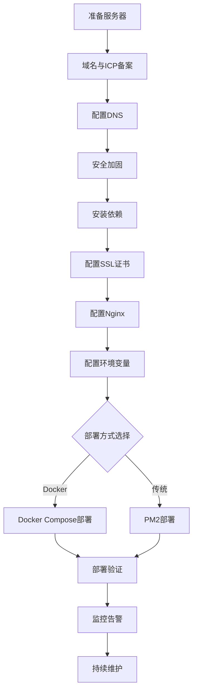

# 中国生产环境部署手册 (China Production Deployment Manual)

本文档提供在中国云服务提供商（阿里云、腾讯云）上部署 Nuxt 3 + Strapi CMS 应用的完整指南，涵盖服务器配置、网络安全、SSL 证书、反向代理配置和部署流程。

> **📚 相关文档**:
> - [中国合规检查清单](./COMPLIANCE_CHECKLIST_CN.md) - ICP备案、数据驻留、隐私保护
> - [生产环境检查清单](./PRODUCTION_CHECKLIST.md) - 上线前全面检查
> - [安全配置指南](./SECURITY_CN.md) - 安全标头、CORS、访问频率限制、HTTPS强制
> - [部署策略](./DEPLOYMENT_STRATEGY.md) - 蓝绿部署和零停机时间
> - [监控运维指南](./MONITORING.md) - 监控、日志和告警
> - [Docker 部署](./DOCKER.md) - 容器化部署详细说明

## 📋 目录

- [云服务商选择](#云服务商选择)
- [服务器规格与配置](#服务器规格与配置)
- [操作系统安全加固](#操作系统安全加固)
- [网络与防火墙配置](#网络与防火墙配置)
- [域名与ICP备案](#域名与icp备案)
- [DNS配置](#dns配置)
- [SSL证书配置](#ssl证书配置)
- [Nginx反向代理配置](#nginx反向代理配置)
- [环境变量配置](#环境变量配置)
- [Docker Compose部署](#docker-compose部署)
- [PM2部署方案](#pm2部署方案)
- [部署验证](#部署验证)
- [故障排除](#故障排除)

---

## 云服务商选择

### 主流云服务商对比

#### 阿里云 (Alibaba Cloud)

**优势**:
- 市场份额最大，资源丰富
- ICP备案流程成熟，通常审核较快
- CDN覆盖广泛，国内访问速度优秀
- 完善的云产品生态（OSS、RDS、SLB等）
- 详细的中文文档和技术支持

**推荐场景**:
- 大规模应用部署
- 需要复杂的云服务集成
- 对性能和稳定性要求高

**相关产品**:
- **ECS** (弹性计算服务) - 云服务器
- **RDS** (关系型数据库) - PostgreSQL托管服务
- **SLB** (负载均衡) - 应用负载均衡器
- **CDN** - 内容分发网络
- **OSS** (对象存储) - 文件存储
- **KMS** (密钥管理) - 密钥和秘密管理

#### 腾讯云 (Tencent Cloud)

**优势**:
- 与微信生态集成便利
- 价格相对实惠
- ICP备案流程高效
- 游戏和音视频场景优化好

**推荐场景**:
- 微信小程序后端
- 中小型应用
- 预算有限的项目

**相关产品**:
- **CVM** (云服务器)
- **TencentDB** - PostgreSQL托管数据库
- **CLB** (负载均衡)
- **CDN** - 内容加速
- **COS** (对象存储)
- **SSM** (凭据管理)

#### 华为云 (Huawei Cloud)

**优势**:
- 政企客户支持好
- 安全和合规性强
- 技术支持响应快

**推荐场景**:
- 政府和国企项目
- 对安全性要求极高的应用

### 选择建议

| 项目规模 | 推荐云商 | 配置建议 |
|---------|---------|---------|
| 小型试点 | 腾讯云 | 2核4GB ECS + 托管数据库 |
| 中型应用 | 阿里云/腾讯云 | 4核8GB ECS + RDS + CDN |
| 大型应用 | 阿里云 | 集群部署 + 负载均衡 + 完整云产品栈 |
| 政企项目 | 华为云 | 根据安全等级要求配置 |

---

## 服务器规格与配置

### 生产环境推荐配置

#### 基础配置 (小型应用)

```yaml
服务器规格:
  CPU: 2核心 (2 vCPU)
  内存: 4GB RAM
  存储: 40GB SSD (系统盘) + 100GB SSD (数据盘)
  带宽: 5Mbps (按需可升级)
  操作系统: Ubuntu 22.04 LTS / Alibaba Cloud Linux 3

数据库:
  类型: RDS PostgreSQL 14
  规格: 1核2GB (可独立扩展)
  存储: 50GB SSD

预期负载:
  并发用户: 100-500
  日PV: 1万以内
  响应时间: < 500ms
```

**月成本估算**: ¥300-500元 (阿里云/腾讯云)

#### 标准配置 (中型应用)

```yaml
服务器规格:
  CPU: 4核心 (4 vCPU)
  内存: 8GB RAM
  存储: 80GB SSD (系统盘) + 200GB SSD (数据盘)
  带宽: 10Mbps
  操作系统: Ubuntu 22.04 LTS

数据库:
  类型: RDS PostgreSQL 14
  规格: 2核4GB
  存储: 100GB SSD
  备份: 自动每日备份，保留7天

负载均衡:
  类型: SLB/CLB
  规格: 标准型

CDN:
  流量: 按需计费
  覆盖: 中国大陆全网

预期负载:
  并发用户: 1000-5000
  日PV: 5-10万
  响应时间: < 300ms
```

**月成本估算**: ¥1000-2000元

#### 高性能配置 (大型应用)

```yaml
应用服务器 (2台以上):
  CPU: 8核心
  内存: 16GB RAM
  存储: 100GB SSD + 500GB 数据盘
  带宽: 20Mbps

数据库:
  类型: RDS PostgreSQL 14 (主从版)
  主实例: 4核8GB
  只读实例: 2核4GB (1-2个)
  存储: 500GB SSD
  
Redis缓存:
  规格: 2GB (单机版) / 8GB (主从版)

负载均衡:
  类型: 高性能型 SLB
  
CDN:
  包月流量包: 500GB-1TB

预期负载:
  并发用户: 10000+
  日PV: 50万+
  响应时间: < 200ms
```

**月成本估算**: ¥5000-10000元

### 存储规划

#### 系统盘布局

```bash
/          # 根分区 (30GB)
/var       # 日志和应用数据 (剩余空间)
```

#### 数据盘布局 (推荐挂载独立数据盘)

```bash
/data/app       # 应用代码和构建文件
/data/uploads   # CMS上传文件
/data/backups   # 数据库备份
/data/logs      # 应用日志归档
```

#### 磁盘挂载配置

```bash
# 查看可用磁盘
lsblk

# 格式化数据盘 (假设为 /dev/vdb)
sudo mkfs.ext4 /dev/vdb

# 创建挂载点
sudo mkdir -p /data

# 挂载数据盘
sudo mount /dev/vdb /data

# 获取UUID
sudo blkid /dev/vdb

# 配置自动挂载
echo "UUID=<your-uuid> /data ext4 defaults,nofail 0 2" | sudo tee -a /etc/fstab

# 创建应用目录
sudo mkdir -p /data/{app,uploads,backups,logs}
sudo chown -R $USER:$USER /data/app
```

---

## 操作系统安全加固

### 基础安全配置

#### 1. 更新系统

```bash
# Ubuntu/Debian
sudo apt update && sudo apt upgrade -y
sudo apt autoremove -y

# CentOS/AliyunOS
sudo yum update -y
sudo yum clean all
```

#### 2. 配置防火墙 (UFW)

```bash
# 安装UFW
sudo apt install ufw -y

# 默认策略：拒绝所有入站，允许所有出站
sudo ufw default deny incoming
sudo ufw default allow outgoing

# 允许必要端口
sudo ufw allow 22/tcp     # SSH
sudo ufw allow 80/tcp     # HTTP
sudo ufw allow 443/tcp    # HTTPS

# 限制SSH连接速率（防暴力破解）
sudo ufw limit 22/tcp

# 启用防火墙
sudo ufw enable

# 查看状态
sudo ufw status verbose
```

#### 3. SSH安全加固

```bash
# 编辑SSH配置
sudo nano /etc/ssh/sshd_config

# 推荐配置
# PermitRootLogin no                    # 禁止root登录
# PasswordAuthentication no             # 禁用密码认证（仅密钥）
# PubkeyAuthentication yes              # 启用公钥认证
# Port 22                               # 可改为非标准端口
# MaxAuthTries 3                        # 最大认证尝试
# ClientAliveInterval 300               # 5分钟无活动断开
# ClientAliveCountMax 2

# 重启SSH服务
sudo systemctl restart sshd
```

#### 4. 配置SSH密钥认证

```bash
# 在本地生成密钥对（如果还没有）
ssh-keygen -t ed25519 -C "your_email@example.com"

# 上传公钥到服务器
ssh-copy-id -i ~/.ssh/id_ed25519.pub user@server-ip

# 测试密钥登录
ssh -i ~/.ssh/id_ed25519 user@server-ip

# 确认成功后，禁用密码登录（见上一步）
```

#### 5. 安装Fail2Ban（防暴力破解）

```bash
# 安装
sudo apt install fail2ban -y

# 创建本地配置
sudo cp /etc/fail2ban/jail.conf /etc/fail2ban/jail.local

# 编辑配置
sudo nano /etc/fail2ban/jail.local

# 推荐配置
# [sshd]
# enabled = true
# port = 22
# filter = sshd
# logpath = /var/log/auth.log
# maxretry = 5
# bantime = 3600
# findtime = 600

# 启动Fail2Ban
sudo systemctl enable fail2ban
sudo systemctl start fail2ban

# 查看状态
sudo fail2ban-client status
sudo fail2ban-client status sshd
```

#### 6. 配置自动安全更新

```bash
# 安装unattended-upgrades
sudo apt install unattended-upgrades -y

# 启用自动更新
sudo dpkg-reconfigure --priority=low unattended-upgrades

# 编辑配置
sudo nano /etc/apt/apt.conf.d/50unattended-upgrades

# 推荐配置：仅安装安全更新，自动重启时间配置
# Unattended-Upgrade::Automatic-Reboot "true";
# Unattended-Upgrade::Automatic-Reboot-Time "03:00";
```

### 系统加固检查清单

- [ ] 系统已更新到最新版本
- [ ] 防火墙已配置并启用
- [ ] SSH已加固（禁用root登录、密钥认证）
- [ ] Fail2Ban已安装并运行
- [ ] 自动安全更新已配置
- [ ] 非必要服务已禁用
- [ ] 系统日志正常记录
- [ ] 设置时区为中国标准时间（`sudo timedatectl set-timezone Asia/Shanghai`）

---

## 网络与防火墙配置

### 云安全组配置

云服务商的安全组是第一道防线，需要正确配置入站和出站规则。

#### 阿里云安全组规则示例

**入站规则**:

| 协议 | 端口范围 | 授权对象 | 说明 |
|-----|---------|---------|------|
| SSH | 22 | 公司IP/VPN | SSH管理端口 |
| HTTP | 80 | 0.0.0.0/0 | Web访问 |
| HTTPS | 443 | 0.0.0.0/0 | Web访问（SSL） |
| 自定义 | 1337 | 127.0.0.1/32 | Strapi（仅本地） |
| 自定义 | 3000 | 127.0.0.1/32 | Nuxt（仅本地） |

**出站规则**:
- 允许所有出站流量（或根据需要限制）

#### 腾讯云安全组规则

配置类似，在腾讯云控制台 → 云服务器 → 安全组中配置。

### CDN配置（推荐）

使用CDN可以显著提升中国大陆用户访问速度，并提供额外的DDoS防护。

#### 阿里云CDN配置步骤

1. **开通CDN服务**
   - 登录阿里云控制台
   - 产品与服务 → CDN → 立即开通

2. **添加加速域名**
   ```
   加速域名: cdn.yourdomain.com
   业务类型: 网站加速
   源站信息: 
     - 类型: IP
     - 地址: 你的服务器公网IP
     - 端口: 80
   加速区域: 仅中国大陆
   ```

3. **配置HTTPS**
   - 在CDN域名管理中上传SSL证书
   - 启用HTTP/2
   - 配置强制HTTPS跳转

4. **配置缓存规则**
   ```
   静态资源缓存:
   - *.js, *.css: 30天
   - *.jpg, *.png, *.gif: 7天
   - *.svg, *.woff2: 365天
   
   动态内容:
   - /api/*: 不缓存
   - /admin/*: 不缓存
   - /: 10分钟
   ```

5. **配置回源策略**
   ```
   回源Host: www.yourdomain.com
   回源协议: 协议跟随
   ```

6. **CNAME解析**
   - CDN会分配一个CNAME域名（如 yourdomain.w.kunlunsl.com）
   - 在DNS中添加CNAME记录指向此地址

#### 腾讯云CDN配置

流程类似，在腾讯云控制台 → CDN → 域名管理中配置。

### DDoS和WAF防护

#### 基础DDoS防护（云服务商自带）

- 阿里云：提供5Gbps基础DDoS防护
- 腾讯云：提供2-10Gbps基础防护

#### WAF（Web应用防火墙）配置（可选）

对于高价值应用，推荐启用WAF：

```
功能:
- SQL注入防护
- XSS攻击防护
- 恶意爬虫拦截
- CC攻击防护
- 0day漏洞虚拟补丁

价格:
- 阿里云WAF: ¥3880/年起
- 腾讯云WAF: ¥3588/年起
```

---

## 域名与ICP备案

### 域名注册

#### 1. 选择域名注册商

**推荐注册商**:
- 阿里云万网
- 腾讯云DNSPod
- 西部数码
- 新网

**选择建议**:
- 选择与云服务器同一家运营商，方便ICP备案
- 优先选择 `.com`, `.cn`, `.com.cn` 等常见后缀

#### 2. 域名实名认证

注册后需要进行实名认证（1-3个工作日）：
- 上传身份证/营业执照
- 填写联系方式
- 等待审核通过

### ICP备案流程

详细的ICP备案要求请参阅 [中国合规检查清单](./COMPLIANCE_CHECKLIST_CN.md#icp备案要求)。

#### 快速流程概览


#### 备案时间规划

| 阶段 | 耗时 | 备注 |
|-----|------|------|
| 材料准备 | 1-2天 | 准备证件、拍照等 |
| 域名实名认证 | 1-3天 | 首次注册域名需要 |
| 服务商初审 | 1-3天 | 材料审核和修改 |
| 管局审核 | 7-20天 | 不同省份时间不同 |
| **总计** | **10-28天** | **建议预留1个月** |

#### 备案关键要点

1. **服务器要求**
   - 必须使用中国大陆服务器
   - 确保有备案服务号（购买3个月以上的ECS会赠送）

2. **备案主体**
   - 企业备案：需要营业执照
   - 个人备案：仅限非经营性网站，不能包含商业内容

3. **网站内容要求**
   - 不能在备案前开放访问
   - 备案期间网站必须关闭或显示"网站正在建设中"
   - 内容必须合法合规，无违禁信息

4. **常见问题**
   - **问**: 备案期间网站能访问吗？
     **答**: 不能，必须关闭（可以用国外服务器临时运行测试版）
   
   - **问**: 一个服务器能备案几个域名？
     **答**: 阿里云每个ECS有5个备案服务号，每个服务号可备案1个域名
   
   - **问**: 备案通过后多久能访问？
     **答**: 通过后即可解析域名并正常访问

### 公安备案

ICP备案通过后30天内需完成公安备案：

```
流程:
1. 访问 全国公安机关互联网站安全管理服务平台
   http://www.beian.gov.cn
2. 注册账号并登录
3. 新办网站申请
4. 填写网站和主体信息
5. 等待审核（约7-15个工作日）
6. 获得公安备案号（如：京公网安备 11010502012345号）
7. 在网站底部展示备案号并链接到备案系统
```

---

## DNS配置

### DNS解析服务商

推荐使用云服务商的DNS服务：
- **阿里云DNS**: 免费版即可满足需求
- **腾讯云DNSPod**: 专业的DNS服务
- **CloudFlare**: 国际用户可访问（国内可能较慢）

### 基本DNS记录配置

#### 不使用CDN的配置

```dns
记录类型: A
主机记录: @
记录值: <服务器公网IP>
TTL: 600

记录类型: A
主机记录: www
记录值: <服务器公网IP>
TTL: 600

记录类型: CNAME
主机记录: admin
记录值: www.yourdomain.com
TTL: 600
```

#### 使用CDN的配置

```dns
# 主域名和www指向CDN
记录类型: CNAME
主机记录: @
记录值: <CDN分配的CNAME域名>
TTL: 600

记录类型: CNAME
主机记录: www
记录值: <CDN分配的CNAME域名>
TTL: 600

# API和管理后台直接指向源站（可选）
记录类型: A
主机记录: api
记录值: <服务器公网IP>
TTL: 600

记录类型: A
主机记录: admin
记录值: <服务器公网IP>
TTL: 600
```

### 邮箱记录配置（可选）

如果需要使用企业邮箱：

```dns
记录类型: MX
主机记录: @
记录值: mxdomain.qq.com (腾讯企业邮箱示例)
优先级: 5
TTL: 600

记录类型: TXT
主机记录: @
记录值: v=spf1 include:spf.mail.qq.com ~all
TTL: 600
```

### DNS解析验证

```bash
# 查询A记录
dig yourdomain.com A
nslookup yourdomain.com

# 查询CNAME记录
dig www.yourdomain.com CNAME

# 查询MX记录
dig yourdomain.com MX

# 测试DNS传播
# 使用在线工具: https://www.whatsmydns.net/
```

---

## SSL证书配置

### SSL证书选择

#### 选项1: Let's Encrypt（推荐 - 免费）

**优势**:
- 完全免费
- 自动续期
- 受所有主流浏览器信任
- 支持通配符证书

**限制**:
- 单次有效期90天（需自动续期）
- 不提供保险赔付
- 不适合对证书品牌有要求的企业

**适用场景**: 中小型应用、创业项目

#### 选项2: 国内CA证书（付费）

**主流CA**:
- **WoSign (沃通)**: ¥368/年起
- **TrustAsia (亚洲诚信)**: ¥1888/年起
- **CFCA (中国金融认证中心)**: 政务、金融行业
- **阿里云SSL证书**: ¥1288/年起（DV单域名）

**优势**:
- 中文技术支持
- 企业品牌背书
- 保险赔付
- 合规性更好

**适用场景**: 大型企业、金融、政务、高价值应用

#### 选项3: 国际CA证书

- **DigiCert**: 高端证书
- **GlobalSign**: 企业级
- **Sectigo (原Comodo)**: 性价比高

### Let's Encrypt证书申请与配置

#### 1. 安装Certbot

```bash
# Ubuntu 22.04
sudo apt update
sudo apt install certbot python3-certbot-nginx -y

# 或者使用snap安装（推荐）
sudo snap install --classic certbot
sudo ln -s /snap/bin/certbot /usr/bin/certbot
```

#### 2. 申请证书（使用Nginx插件）

```bash
# 自动配置Nginx（最简单方式）
sudo certbot --nginx -d yourdomain.com -d www.yourdomain.com

# 仅获取证书（手动配置Nginx）
sudo certbot certonly --nginx -d yourdomain.com -d www.yourdomain.com

# 使用DNS验证（适合防火墙限制或通配符证书）
sudo certbot certonly --manual --preferred-challenges dns -d yourdomain.com -d *.yourdomain.com
```

#### 3. 证书文件位置

```bash
# 证书默认保存在
/etc/letsencrypt/live/yourdomain.com/
├── fullchain.pem    # 完整证书链（在Nginx中使用）
├── privkey.pem      # 私钥
├── cert.pem         # 证书
└── chain.pem        # 中间证书

# 实际文件是符号链接到archive目录
/etc/letsencrypt/archive/yourdomain.com/
```

#### 4. 自动续期配置

```bash
# Certbot自动创建了续期定时任务
# 查看定时任务
sudo systemctl list-timers | grep certbot

# 测试续期（不会真正续期）
sudo certbot renew --dry-run

# 手动续期（证书到期前30天内有效）
sudo certbot renew

# 配置续期后重启Nginx（如果需要）
sudo certbot renew --deploy-hook "systemctl reload nginx"
```

#### 5. 自定义续期脚本

创建 `/etc/letsencrypt/renewal-hooks/deploy/reload-nginx.sh`:

```bash
#!/bin/bash
# Let's Encrypt证书更新后重载Nginx

systemctl reload nginx

# 可选：发送通知
# curl -X POST https://your-webhook-url \
#   -d "SSL certificate renewed for $(hostname)"
```

添加执行权限：

```bash
sudo chmod +x /etc/letsencrypt/renewal-hooks/deploy/reload-nginx.sh
```

### 国内CA证书申请

#### 阿里云SSL证书申请步骤

1. **购买证书**
   - 登录阿里云控制台
   - 产品与服务 → SSL证书 → 购买证书
   - 选择品牌和类型（DV/OV/EV）

2. **申请签发**
   - 补全域名信息
   - 选择验证方式（DNS验证/文件验证）
   - 上传企业资质（OV/EV证书）

3. **DNS验证**
   ```
   在DNS添加TXT记录:
   主机记录: _dnsauth
   记录值: <阿里云提供的验证值>
   ```

4. **下载证书**
   - 审核通过后下载Nginx格式证书
   - 包含: domain.pem (证书) 和 domain.key (私钥)

5. **上传到服务器**
   ```bash
   # 创建证书目录
   sudo mkdir -p /etc/nginx/ssl
   
   # 上传证书文件
   sudo scp domain.pem domain.key user@server:/tmp/
   
   # 移动到证书目录
   sudo mv /tmp/domain.pem /etc/nginx/ssl/
   sudo mv /tmp/domain.key /etc/nginx/ssl/
   
   # 设置权限
   sudo chmod 600 /etc/nginx/ssl/domain.key
   sudo chmod 644 /etc/nginx/ssl/domain.pem
   ```

### SSL安全配置最佳实践

#### 1. 生成DH参数（增强安全性）

```bash
# 生成2048位DH参数（需要几分钟）
sudo openssl dhparam -out /etc/nginx/ssl/dhparam.pem 2048

# 或使用4096位（更安全但更慢）
sudo openssl dhparam -out /etc/nginx/ssl/dhparam.pem 4096
```

#### 2. 推荐的SSL配置

参见后续的 [Nginx反向代理配置](#nginx反向代理配置) 章节。

---

## Nginx反向代理配置

Nginx作为反向代理和负载均衡器，为Docker容器或PM2进程提供入口。

### 安装Nginx

```bash
# Ubuntu/Debian
sudo apt update
sudo apt install nginx -y

# 启动并设置开机自启
sudo systemctl start nginx
sudo systemctl enable nginx

# 查看状态
sudo systemctl status nginx

# 验证配置
sudo nginx -t
```

### Nginx目录结构

```bash
/etc/nginx/
├── nginx.conf              # 主配置文件
├── sites-available/        # 可用站点配置
│   └── yourdomain.com      # 你的站点配置
├── sites-enabled/          # 启用的站点（符号链接）
│   └── yourdomain.com -> ../sites-available/yourdomain.com
├── conf.d/                 # 额外配置文件
├── ssl/                    # SSL证书（手动创建）
└── snippets/               # 可复用的配置片段
```

### 生产环境Nginx配置

创建 `/etc/nginx/sites-available/yourdomain.com`:

```nginx
# HTTP to HTTPS redirect
server {
    listen 80;
    listen [::]:80;
    server_name yourdomain.com www.yourdomain.com;

    # Let's Encrypt ACME challenge
    location ^~ /.well-known/acme-challenge/ {
        default_type "text/plain";
        root /var/www/certbot;
    }

    # Redirect all HTTP traffic to HTTPS
    location / {
        return 301 https://$server_name$request_uri;
    }
}

# HTTPS server
server {
    listen 443 ssl http2;
    listen [::]:443 ssl http2;
    server_name yourdomain.com www.yourdomain.com;

    # SSL证书配置 (Let's Encrypt)
    ssl_certificate /etc/letsencrypt/live/yourdomain.com/fullchain.pem;
    ssl_certificate_key /etc/letsencrypt/live/yourdomain.com/privkey.pem;
    
    # SSL优化配置
    ssl_session_timeout 1d;
    ssl_session_cache shared:SSL:50m;
    ssl_session_tickets off;

    # 现代浏览器SSL配置（推荐）
    ssl_protocols TLSv1.2 TLSv1.3;
    ssl_ciphers 'ECDHE-ECDSA-AES128-GCM-SHA256:ECDHE-RSA-AES128-GCM-SHA256:ECDHE-ECDSA-AES256-GCM-SHA384:ECDHE-RSA-AES256-GCM-SHA384:ECDHE-ECDSA-CHACHA20-POLY1305:ECDHE-RSA-CHACHA20-POLY1305:DHE-RSA-AES128-GCM-SHA256:DHE-RSA-AES256-GCM-SHA384';
    ssl_prefer_server_ciphers off;

    # DH参数
    ssl_dhparam /etc/nginx/ssl/dhparam.pem;

    # HSTS (HTTP Strict Transport Security)
    add_header Strict-Transport-Security "max-age=63072000; includeSubDomains; preload" always;

    # 安全头
    add_header X-Frame-Options "SAMEORIGIN" always;
    add_header X-Content-Type-Options "nosniff" always;
    add_header X-XSS-Protection "1; mode=block" always;
    add_header Referrer-Policy "no-referrer-when-downgrade" always;
    add_header Content-Security-Policy "default-src 'self' http: https: data: blob: 'unsafe-inline'" always;

    # Gzip压缩
    gzip on;
    gzip_vary on;
    gzip_proxied any;
    gzip_comp_level 6;
    gzip_types text/plain text/css text/xml text/javascript application/json application/javascript application/xml+rss application/rss+xml font/truetype font/opentype application/vnd.ms-fontobject image/svg+xml;
    gzip_disable "msie6";

    # Brotli压缩（如果安装了ngx_brotli模块）
    # brotli on;
    # brotli_comp_level 6;
    # brotli_types text/plain text/css text/xml text/javascript application/json application/javascript application/xml+rss application/rss+xml font/truetype font/opentype application/vnd.ms-fontobject image/svg+xml;

    # 访问日志
    access_log /var/log/nginx/yourdomain_access.log;
    error_log /var/log/nginx/yourdomain_error.log;

    # 上传文件大小限制
    client_max_body_size 50M;

    # 健康检查端点
    location /health {
        access_log off;
        return 200 "healthy\n";
        add_header Content-Type text/plain;
    }

    # CMS管理后台
    location /admin {
        # 可选：限制管理后台IP访问
        # allow 1.2.3.4;  # 公司IP
        # deny all;

        proxy_pass http://127.0.0.1:1337;
        proxy_http_version 1.1;
        proxy_set_header Upgrade $http_upgrade;
        proxy_set_header Connection 'upgrade';
        proxy_set_header Host $host;
        proxy_set_header X-Real-IP $remote_addr;
        proxy_set_header X-Forwarded-For $proxy_add_x_forwarded_for;
        proxy_set_header X-Forwarded-Proto $scheme;
        proxy_cache_bypass $http_upgrade;

        # 超时配置
        proxy_connect_timeout 60s;
        proxy_send_timeout 60s;
        proxy_read_timeout 60s;
    }

    # CMS API
    location /api/ {
        # API速率限制
        limit_req zone=api_limit burst=20 nodelay;
        limit_req_status 429;

        proxy_pass http://127.0.0.1:1337;
        proxy_http_version 1.1;
        proxy_set_header Upgrade $http_upgrade;
        proxy_set_header Connection 'upgrade';
        proxy_set_header Host $host;
        proxy_set_header X-Real-IP $remote_addr;
        proxy_set_header X-Forwarded-For $proxy_add_x_forwarded_for;
        proxy_set_header X-Forwarded-Proto $scheme;
        proxy_cache_bypass $http_upgrade;

        proxy_connect_timeout 60s;
        proxy_send_timeout 60s;
        proxy_read_timeout 60s;
    }

    # CMS上传文件
    location /uploads/ {
        proxy_pass http://127.0.0.1:1337;
        proxy_set_header Host $host;
        proxy_set_header X-Real-IP $remote_addr;
        proxy_set_header X-Forwarded-For $proxy_add_x_forwarded_for;
        proxy_set_header X-Forwarded-Proto $scheme;

        # 静态文件缓存
        expires 7d;
        add_header Cache-Control "public, immutable";
    }

    # Nuxt前端应用
    location / {
        # 一般页面速率限制
        limit_req zone=general_limit burst=50 nodelay;

        proxy_pass http://127.0.0.1:3000;
        proxy_http_version 1.1;
        proxy_set_header Upgrade $http_upgrade;
        proxy_set_header Connection 'upgrade';
        proxy_set_header Host $host;
        proxy_set_header X-Real-IP $remote_addr;
        proxy_set_header X-Forwarded-For $proxy_add_x_forwarded_for;
        proxy_set_header X-Forwarded-Proto $scheme;
        proxy_cache_bypass $http_upgrade;

        proxy_connect_timeout 60s;
        proxy_send_timeout 60s;
        proxy_read_timeout 60s;
    }

    # 静态资源缓存
    location ~* \.(jpg|jpeg|png|gif|ico|css|js|svg|woff|woff2|ttf|eot|webp)$ {
        proxy_pass http://127.0.0.1:3000;
        expires 1y;
        add_header Cache-Control "public, immutable";
        access_log off;
    }

    # ICP备案号页面（如果需要单独页面）
    location = /icp {
        return 200 '<!DOCTYPE html><html><head><meta charset="utf-8"><title>ICP备案信息</title></head><body><p>ICP备案号: 京ICP备12345678号</p><p>公安备案号: 京公网安备 11010502012345号</p></body></html>';
        add_header Content-Type text/html;
    }
}
```

### Nginx主配置文件优化

编辑 `/etc/nginx/nginx.conf`:

```nginx
user www-data;
worker_processes auto;
pid /run/nginx.pid;
include /etc/nginx/modules-enabled/*.conf;

events {
    worker_connections 2048;
    use epoll;
    multi_accept on;
}

http {
    ##
    # 基础设置
    ##
    sendfile on;
    tcp_nopush on;
    tcp_nodelay on;
    keepalive_timeout 65;
    types_hash_max_size 2048;
    server_tokens off;  # 隐藏Nginx版本号

    # 服务器名哈希表大小
    server_names_hash_bucket_size 64;

    include /etc/nginx/mime.types;
    default_type application/octet-stream;

    ##
    # 日志设置
    ##
    log_format main '$remote_addr - $remote_user [$time_local] "$request" '
                    '$status $body_bytes_sent "$http_referer" '
                    '"$http_user_agent" "$http_x_forwarded_for"';

    access_log /var/log/nginx/access.log main;
    error_log /var/log/nginx/error.log warn;

    ##
    # Gzip设置
    ##
    gzip on;
    gzip_vary on;
    gzip_proxied any;
    gzip_comp_level 6;
    gzip_buffers 16 8k;
    gzip_http_version 1.1;
    gzip_types text/plain text/css application/json application/javascript text/xml application/xml application/xml+rss text/javascript;
    gzip_disable "msie6";

    ##
    # 速率限制配置
    ##
    limit_req_zone $binary_remote_addr zone=api_limit:10m rate=10r/s;
    limit_req_zone $binary_remote_addr zone=general_limit:10m rate=50r/s;

    ##
    # 连接限制
    ##
    limit_conn_zone $binary_remote_addr zone=conn_limit:10m;

    ##
    # 缓冲区设置
    ##
    client_body_buffer_size 128k;
    client_max_body_size 50m;
    client_header_buffer_size 1k;
    large_client_header_buffers 4 4k;
    output_buffers 1 32k;
    postpone_output 1460;

    ##
    # 超时设置
    ##
    client_header_timeout 30;
    client_body_timeout 30;
    send_timeout 30;
    reset_timedout_connection on;

    ##
    # 打开文件缓存
    ##
    open_file_cache max=1000 inactive=20s;
    open_file_cache_valid 30s;
    open_file_cache_min_uses 2;
    open_file_cache_errors on;

    ##
    # 虚拟主机配置
    ##
    include /etc/nginx/conf.d/*.conf;
    include /etc/nginx/sites-enabled/*;
}
```

### 启用配置

```bash
# 创建符号链接启用站点
sudo ln -s /etc/nginx/sites-available/yourdomain.com /etc/nginx/sites-enabled/

# 测试配置
sudo nginx -t

# 重载Nginx
sudo systemctl reload nginx

# 如果有错误，查看日志
sudo tail -f /var/log/nginx/error.log
```

### Nginx日志管理

#### 日志轮转配置

创建 `/etc/logrotate.d/nginx`:

```
/var/log/nginx/*.log {
    daily
    missingok
    rotate 14
    compress
    delaycompress
    notifempty
    create 0640 www-data adm
    sharedscripts
    prerotate
        if [ -d /etc/logrotate.d/httpd-prerotate ]; then \
            run-parts /etc/logrotate.d/httpd-prerotate; \
        fi
    endscript
    postrotate
        invoke-rc.d nginx rotate >/dev/null 2>&1
    endscript
}
```

#### 实时监控访问日志

```bash
# 实时查看访问日志
sudo tail -f /var/log/nginx/yourdomain_access.log

# 查看错误日志
sudo tail -f /var/log/nginx/yourdomain_error.log

# 分析访问量最大的IP
sudo awk '{print $1}' /var/log/nginx/yourdomain_access.log | sort | uniq -c | sort -nr | head -20

# 分析最常访问的URL
sudo awk '{print $7}' /var/log/nginx/yourdomain_access.log | sort | uniq -c | sort -nr | head -20

# 分析HTTP状态码分布
sudo awk '{print $9}' /var/log/nginx/yourdomain_access.log | sort | uniq -c | sort -nr
```

---

## 环境变量配置

### 环境变量管理策略

#### 1. 文件结构

```bash
项目环境变量文件:
├── .env.example              # 示例文件（提交到Git）
├── .env                      # 开发环境（不提交）
├── .env.production           # 生产环境（不提交，服务器上配置）
├── .env.docker.example       # Docker示例
└── .env.docker               # Docker实际配置（不提交）
```

#### 2. 创建生产环境配置

在服务器上创建 `/data/app/.env.production`:

```bash
# 拷贝示例文件
cp .env.example .env.production

# 编辑生产环境配置
nano .env.production
```

### 完整的生产环境变量配置

```bash
# ===== 应用基础配置 =====
HOST=0.0.0.0
PORT=1337
NODE_ENV=production

# ===== Strapi密钥配置 =====
# 使用以下命令生成强密钥：openssl rand -base64 32
APP_KEYS="<generated-key-1>,<generated-key-2>,<generated-key-3>,<generated-key-4>"
API_TOKEN_SALT=<generated-salt>
ADMIN_JWT_SECRET=<generated-secret>
TRANSFER_TOKEN_SALT=<generated-salt>
JWT_SECRET=<generated-secret>
ENCRYPTION_KEY=<generated-key>

# ===== 数据库配置 =====
DATABASE_CLIENT=postgres
DATABASE_HOST=<your-rds-host>.rds.aliyuncs.com
DATABASE_PORT=5432
DATABASE_NAME=strapi_prod
DATABASE_USERNAME=strapi
DATABASE_PASSWORD=<strong-password>
DATABASE_SSL=true

# ===== Redis配置（如果使用）=====
REDIS_HOST=<your-redis-host>
REDIS_PORT=6379
REDIS_PASSWORD=<redis-password>

# ===== Nuxt前端配置 =====
NUXT_PUBLIC_API_BASE_URL=https://yourdomain.com
NUXT_PUBLIC_STRAPI_URL=https://yourdomain.com
NUXT_STRAPI_API_TOKEN=<generated-api-token>
NUXT_STRAPI_URL=http://127.0.0.1:1337

# ===== ICP备案配置（必填）=====
ICP_FILING_NUMBER=京ICP备12345678号
PUBLIC_SECURITY_FILING_NUMBER=京公网安备11010502012345号

# ===== 隐私与Cookie合规 =====
PRIVACY_POLICY_URL=/privacy-policy
COOKIE_POLICY_URL=/cookie-policy
COOKIE_CONSENT_ENABLED=true

# ===== 数据驻留 =====
DATA_RESIDENCY=CN
DATABASE_REGION=cn-beijing
CDN_REGION=cn

# ===== 个人信息保护 =====
PERSONAL_INFO_PROTECTION_ENABLED=true
PERSONAL_INFO_OFFICER_NAME=张三
PERSONAL_INFO_OFFICER_EMAIL=privacy@yourdomain.com
PERSONAL_INFO_OFFICER_PHONE=010-12345678

# ===== 网络安全等级保护 =====
MLPS_LEVEL=2
MLPS_FILING_NUMBER=<filing-number>

# ===== 内容审核（可选）=====
CONTENT_MODERATION_ENABLED=false
CONTENT_MODERATION_PROVIDER=aliyun  # aliyun, tencent, baidu

# ===== 实名认证（可选）=====
REAL_NAME_VERIFICATION_ENABLED=false

# ===== 未成年人保护 =====
MINOR_PROTECTION_ENABLED=true
MIN_AGE_REQUIREMENT=14

# ===== 审计日志 =====
AUDIT_LOG_ENABLED=true
AUDIT_LOG_RETENTION_DAYS=180

# ===== 跨境数据传输 =====
CROSS_BORDER_DATA_TRANSFER_ENABLED=false

# ===== 对象存储配置（可选）=====
# 阿里云OSS
OSS_PROVIDER=aliyun
OSS_ACCESS_KEY_ID=<access-key>
OSS_ACCESS_KEY_SECRET=<secret-key>
OSS_REGION=oss-cn-beijing
OSS_BUCKET=your-bucket-name
OSS_ENDPOINT=https://oss-cn-beijing.aliyuncs.com

# ===== 邮件服务配置（可选）=====
SMTP_HOST=smtp.exmail.qq.com
SMTP_PORT=465
SMTP_SECURE=true
SMTP_USERNAME=noreply@yourdomain.com
SMTP_PASSWORD=<email-password>
SMTP_FROM_EMAIL=noreply@yourdomain.com
SMTP_FROM_NAME=Your App Name

# ===== 监控配置（可选）=====
SENTRY_DSN=<sentry-dsn>
SENTRY_ENVIRONMENT=production

# ===== 分析工具（可选）=====
# 百度统计
BAIDU_ANALYTICS_ID=<baidu-analytics-id>
# 友盟
UMENG_ANALYTICS_ID=<umeng-id>
```

### 环境变量验证脚本

项目已包含环境变量验证脚本：[scripts/deploy/preflight.sh](../scripts/deploy/preflight.sh)

使用方法：

```bash
# 运行部署前检查（包括环境变量验证）
pnpm deploy:preflight

# 或直接运行脚本
bash scripts/deploy/preflight.sh
```

### 密钥生成工具

#### 生成强密钥

```bash
# 生成单个密钥
openssl rand -base64 32

# 批量生成多个密钥
for i in {1..4}; do
  echo "Key $i: $(openssl rand -base64 32)"
done

# 生成APP_KEYS（逗号分隔）
echo "APP_KEYS=\"$(openssl rand -base64 32),$(openssl rand -base64 32),$(openssl rand -base64 32),$(openssl rand -base64 32)\""
```

#### 生成Strapi API Token

```bash
# 在Strapi管理后台生成:
# 1. 登录 http://your-domain.com/admin
# 2. Settings → API Tokens → Create new API Token
# 3. Name: Production Frontend
# 4. Token type: Read-only (推荐) 或 Full access
# 5. Token duration: Unlimited
# 6. 复制生成的token到NUXT_STRAPI_API_TOKEN
```

### 密钥管理最佳实践

#### 选项1: 使用云服务商密钥管理

**阿里云KMS (Key Management Service)**:

```bash
# 安装阿里云CLI
wget https://aliyuncli.alicdn.com/aliyun-cli-linux-latest-amd64.tgz
tar -xzf aliyun-cli-linux-latest-amd64.tgz
sudo mv aliyun /usr/local/bin/

# 配置凭证
aliyun configure

# 创建密钥
aliyun kms CreateKey --KeyUsage=ENCRYPT/DECRYPT

# 加密敏感数据
aliyun kms Encrypt --KeyId=<key-id> --Plaintext="my-secret"

# 在应用中解密（需要安装阿里云SDK）
```

**腾讯云SSM (Secrets Manager)**:

```bash
# 在控制台创建凭据
# 访问: https://console.cloud.tencent.com/ssm

# 使用API获取凭据
# 需要在应用中集成腾讯云SDK
```

#### 选项2: 使用环境变量加密工具

```bash
# 安装dotenv-vault（可选）
npm install -g dotenv-vault

# 加密.env文件
npx dotenv-vault encrypt

# 部署时解密
npx dotenv-vault decrypt
```

#### 选项3: 服务器文件权限保护

```bash
# 确保.env文件权限正确
chmod 600 /data/app/.env.production
chown appuser:appuser /data/app/.env.production

# 防止其他用户读取
ls -la /data/app/.env.production
# 输出应该是: -rw------- 1 appuser appuser
```

---

## Docker Compose部署

Docker Compose是推荐的生产环境部署方式，提供容器隔离、易于扩展和标准化环境。

### 部署前准备

#### 1. 安装Docker和Docker Compose

```bash
# 安装Docker
curl -fsSL https://get.docker.com -o get-docker.sh
sudo sh get-docker.sh

# 将当前用户添加到docker组
sudo usermod -aG docker $USER

# 重新登录使组成员生效
exit
# 重新SSH登录

# 验证Docker安装
docker --version
docker compose version

# 启动Docker服务
sudo systemctl start docker
sudo systemctl enable docker
```

#### 2. 优化Docker配置

创建 `/etc/docker/daemon.json`:

```json
{
  "log-driver": "json-file",
  "log-opts": {
    "max-size": "10m",
    "max-file": "3"
  },
  "storage-driver": "overlay2",
  "registry-mirrors": [
    "https://mirror.ccs.tencentyun.com",
    "https://registry.docker-cn.com"
  ],
  "live-restore": true,
  "userland-proxy": false
}
```

重启Docker：

```bash
sudo systemctl daemon-reload
sudo systemctl restart docker
```

### 生产环境Docker Compose配置

项目已包含 `docker-compose.yml`，但需要为生产环境创建优化版本。

创建 `docker-compose.prod.yml`:

```yaml
version: '3.8'

services:
  # PostgreSQL数据库
  postgres:
    image: postgres:16-alpine
    container_name: nuxt-strapi-db-prod
    restart: always
    environment:
      POSTGRES_DB: ${DATABASE_NAME}
      POSTGRES_USER: ${DATABASE_USERNAME}
      POSTGRES_PASSWORD: ${DATABASE_PASSWORD}
    volumes:
      - postgres_data:/var/lib/postgresql/data
      - /data/backups/postgres:/backups  # 备份目录
    networks:
      - app-network
    healthcheck:
      test: ["CMD-SHELL", "pg_isready -U ${DATABASE_USERNAME}"]
      interval: 10s
      timeout: 5s
      retries: 5
    deploy:
      resources:
        limits:
          cpus: '2'
          memory: 2G
        reservations:
          cpus: '0.5'
          memory: 512M

  # Redis缓存
  redis:
    image: redis:7-alpine
    container_name: nuxt-strapi-redis-prod
    restart: always
    command: redis-server --appendonly yes --requirepass ${REDIS_PASSWORD}
    volumes:
      - redis_data:/data
    networks:
      - app-network
    healthcheck:
      test: ["CMD", "redis-cli", "--raw", "incr", "ping"]
      interval: 10s
      timeout: 5s
      retries: 5
    deploy:
      resources:
        limits:
          cpus: '1'
          memory: 512M

  # Strapi CMS
  cms:
    build:
      context: ./apps/cms
      dockerfile: Dockerfile
      args:
        NODE_ENV: production
    image: your-registry.com/strapi-cms:${VERSION:-latest}
    container_name: nuxt-strapi-cms-prod
    restart: always
    depends_on:
      postgres:
        condition: service_healthy
      redis:
        condition: service_healthy
    environment:
      NODE_ENV: production
      HOST: 0.0.0.0
      PORT: 1337
      APP_KEYS: ${APP_KEYS}
      API_TOKEN_SALT: ${API_TOKEN_SALT}
      ADMIN_JWT_SECRET: ${ADMIN_JWT_SECRET}
      TRANSFER_TOKEN_SALT: ${TRANSFER_TOKEN_SALT}
      JWT_SECRET: ${JWT_SECRET}
      DATABASE_CLIENT: postgres
      DATABASE_HOST: postgres
      DATABASE_PORT: 5432
      DATABASE_NAME: ${DATABASE_NAME}
      DATABASE_USERNAME: ${DATABASE_USERNAME}
      DATABASE_PASSWORD: ${DATABASE_PASSWORD}
      DATABASE_SSL: false
      REDIS_HOST: redis
      REDIS_PORT: 6379
      REDIS_PASSWORD: ${REDIS_PASSWORD}
    volumes:
      - cms_uploads:/opt/app/public/uploads
      - /data/app/cms-config:/opt/app/config  # 持久化配置
    ports:
      - "127.0.0.1:1337:1337"  # 仅本地访问
    networks:
      - app-network
    healthcheck:
      test: ["CMD", "wget", "--no-verbose", "--tries=1", "--spider", "http://localhost:1337/_health"]
      interval: 30s
      timeout: 10s
      retries: 3
      start_period: 60s
    deploy:
      resources:
        limits:
          cpus: '2'
          memory: 2G
        reservations:
          cpus: '0.5'
          memory: 512M

  # Nuxt前端
  frontend:
    build:
      context: .
      dockerfile: ./apps/frontend/Dockerfile
      args:
        NODE_ENV: production
    image: your-registry.com/nuxt-frontend:${VERSION:-latest}
    container_name: nuxt-strapi-frontend-prod
    restart: always
    depends_on:
      cms:
        condition: service_healthy
    environment:
      NODE_ENV: production
      NUXT_PUBLIC_API_BASE_URL: ${NUXT_PUBLIC_API_BASE_URL}
      NUXT_PUBLIC_STRAPI_URL: ${NUXT_PUBLIC_STRAPI_URL}
      NUXT_STRAPI_API_TOKEN: ${NUXT_STRAPI_API_TOKEN}
      NUXT_STRAPI_URL: http://cms:1337
    ports:
      - "127.0.0.1:3000:3000"  # 仅本地访问
    networks:
      - app-network
    healthcheck:
      test: ["CMD", "wget", "--no-verbose", "--tries=1", "--spider", "http://localhost:3000/api/health"]
      interval: 30s
      timeout: 10s
      retries: 3
      start_period: 40s
    deploy:
      resources:
        limits:
          cpus: '2'
          memory: 2G
        reservations:
          cpus: '0.5'
          memory: 512M

volumes:
  postgres_data:
    driver: local
  cms_uploads:
    driver: local
  redis_data:
    driver: local

networks:
  app-network:
    driver: bridge
```

### Docker部署步骤

#### 1. 准备代码

```bash
# 在服务器上克隆代码
cd /data/app
git clone <your-repository-url> .

# 或使用Git部署
git pull origin main
```

#### 2. 配置环境变量

```bash
# 拷贝并编辑Docker环境变量
cp .env.docker.example .env.docker
nano .env.docker

# 生成所需的密钥
# 参考前面的"环境变量配置"章节
```

#### 3. 构建镜像

```bash
# 构建所有镜像
docker compose -f docker-compose.prod.yml build

# 或使用缓存加速
docker compose -f docker-compose.prod.yml build --parallel

# 查看构建的镜像
docker images
```

#### 4. 启动服务

```bash
# 启动所有服务（后台运行）
docker compose -f docker-compose.prod.yml up -d

# 查看启动日志
docker compose -f docker-compose.prod.yml logs -f

# 查看容器状态
docker compose -f docker-compose.prod.yml ps
```

#### 5. 初始化数据库和创建管理员

```bash
# 进入CMS容器
docker compose -f docker-compose.prod.yml exec cms sh

# 运行数据库迁移（如果需要）
npm run strapi migrate

# 创建管理员用户
npm run strapi admin:create-user -- \
  --firstname=Admin \
  --lastname=User \
  --email=admin@yourdomain.com \
  --password=<strong-password>

# 退出容器
exit
```

### Docker管理命令

```bash
# 查看日志
docker compose -f docker-compose.prod.yml logs -f [service_name]

# 重启服务
docker compose -f docker-compose.prod.yml restart

# 停止服务
docker compose -f docker-compose.prod.yml stop

# 完全清理（慎用！）
docker compose -f docker-compose.prod.yml down -v

# 更新服务
git pull
docker compose -f docker-compose.prod.yml build
docker compose -f docker-compose.prod.yml up -d

# 查看资源使用
docker stats

# 进入容器调试
docker compose -f docker-compose.prod.yml exec cms sh
docker compose -f docker-compose.prod.yml exec frontend sh

# 备份数据库
docker compose -f docker-compose.prod.yml exec -T postgres pg_dump -U strapi strapi > backup_$(date +%Y%m%d).sql
```

### Docker镜像优化

#### 多阶段构建示例

Frontend Dockerfile (`apps/frontend/Dockerfile`):

```dockerfile
# 构建阶段
FROM node:20-alpine AS builder

WORKDIR /app

# 安装pnpm
RUN npm install -g pnpm

# 拷贝package文件
COPY package.json pnpm-lock.yaml pnpm-workspace.yaml ./
COPY apps/frontend/package.json ./apps/frontend/

# 安装依赖
RUN pnpm install --frozen-lockfile

# 拷贝源代码
COPY . .

# 构建应用
RUN pnpm --filter frontend build

# 生产阶段
FROM node:20-alpine AS runner

WORKDIR /app

# 创建非root用户
RUN addgroup --system --gid 1001 nodejs
RUN adduser --system --uid 1001 nuxt

# 拷贝构建产物
COPY --from=builder --chown=nuxt:nodejs /app/apps/frontend/.output /app/.output

USER nuxt

EXPOSE 3000

ENV HOST=0.0.0.0
ENV PORT=3000
ENV NODE_ENV=production

CMD ["node", ".output/server/index.mjs"]
```

### 使用蓝绿部署

项目包含蓝绿部署脚本，支持Docker环境：

```bash
# 运行蓝绿部署
pnpm deploy:blue-green

# 或直接运行脚本
bash scripts/deploy/blue-green-deploy.sh

# 如果部署失败，快速回滚
pnpm deploy:rollback
```

详见：[部署策略文档](./DEPLOYMENT_STRATEGY.md)

---

## PM2部署方案

PM2是Node.js进程管理器，适合不使用Docker的传统部署场景。

### 安装PM2

```bash
# 全局安装PM2
sudo npm install -g pm2

# 设置开机自启
pm2 startup
# 按照输出的命令执行（通常是sudo env PATH=$PATH...）

# 验证安装
pm2 --version
```

### 构建应用

```bash
cd /data/app

# 安装依赖
pnpm install --frozen-lockfile --prod

# 构建前端和CMS
pnpm build

# 验证构建产物
ls -la apps/frontend/.output/
ls -la apps/cms/dist/
```

### PM2配置文件

创建 `ecosystem.config.js`:

```javascript
module.exports = {
  apps: [
    // Strapi CMS
    {
      name: 'strapi-cms',
      cwd: './apps/cms',
      script: './dist/server.js',
      instances: 1,
      exec_mode: 'fork',
      env: {
        NODE_ENV: 'production',
        HOST: '0.0.0.0',
        PORT: 1337,
      },
      env_file: '/data/app/.env.production',
      error_file: '/data/logs/pm2/cms-error.log',
      out_file: '/data/logs/pm2/cms-out.log',
      log_date_format: 'YYYY-MM-DD HH:mm:ss Z',
      merge_logs: true,
      max_memory_restart: '1G',
      autorestart: true,
      watch: false,
      max_restarts: 10,
      min_uptime: '10s',
    },

    // Nuxt Frontend
    {
      name: 'nuxt-frontend',
      cwd: './apps/frontend',
      script: './.output/server/index.mjs',
      instances: 2,  // 集群模式，根据CPU核心数调整
      exec_mode: 'cluster',
      env: {
        NODE_ENV: 'production',
        HOST: '0.0.0.0',
        PORT: 3000,
      },
      env_file: '/data/app/.env.production',
      error_file: '/data/logs/pm2/frontend-error.log',
      out_file: '/data/logs/pm2/frontend-out.log',
      log_date_format: 'YYYY-MM-DD HH:mm:ss Z',
      merge_logs: true,
      max_memory_restart: '1G',
      autorestart: true,
      watch: false,
      max_restarts: 10,
      min_uptime: '10s',
    },
  ],
};
```

### PM2部署步骤

#### 1. 准备日志目录

```bash
sudo mkdir -p /data/logs/pm2
sudo chown -R $USER:$USER /data/logs/pm2
```

#### 2. 启动应用

```bash
# 使用配置文件启动
pm2 start ecosystem.config.js

# 查看运行状态
pm2 status

# 查看详细信息
pm2 show strapi-cms
pm2 show nuxt-frontend
```

#### 3. 保存PM2配置

```bash
# 保存当前进程列表
pm2 save

# 验证开机自启
pm2 startup
```

### PM2常用命令

```bash
# 查看所有进程
pm2 list

# 查看日志
pm2 logs                    # 所有进程
pm2 logs strapi-cms         # 指定进程
pm2 logs nuxt-frontend --lines 100

# 重启应用
pm2 restart strapi-cms
pm2 restart nuxt-frontend
pm2 restart all

# 重载（零停机时间）
pm2 reload nuxt-frontend    # 仅集群模式支持

# 停止应用
pm2 stop strapi-cms
pm2 stop all

# 删除进程
pm2 delete strapi-cms
pm2 delete all

# 监控
pm2 monit                   # 实时监控
pm2 describe strapi-cms     # 详细信息

# 清空日志
pm2 flush

# 更新PM2
pm2 update
```

### PM2进程管理Web界面（可选）

```bash
# 安装PM2 Plus（免费版）
pm2 link <secret_key> <public_key>

# 或使用开源的PM2-GUI
npm install -g pm2-gui
pm2-gui start
```

### PM2部署更新流程

```bash
# 1. 拉取最新代码
cd /data/app
git pull origin main

# 2. 安装依赖（如果有变化）
pnpm install --frozen-lockfile

# 3. 重新构建
pnpm build

# 4. 重启服务
pm2 restart ecosystem.config.js

# 5. 查看日志确认启动成功
pm2 logs --lines 50
```

### PM2日志轮转

创建 `/data/app/pm2-logrotate.json`:

```json
{
  "max_size": "10M",
  "retain": 10,
  "compress": true,
  "dateFormat": "YYYY-MM-DD_HH-mm-ss",
  "rotateModule": true,
  "workerInterval": 30,
  "rotateInterval": "0 0 * * *"
}
```

安装PM2日志轮转模块：

```bash
pm2 install pm2-logrotate
pm2 set pm2-logrotate:max_size 10M
pm2 set pm2-logrotate:retain 10
pm2 set pm2-logrotate:compress true
```

---

## 部署验证

### 自动化验证脚本

项目已包含部署后验证脚本：[scripts/deploy/post-deploy-verify.sh](../scripts/deploy/post-deploy-verify.sh)

```bash
# 运行部署后验证
pnpm deploy:verify

# 或直接运行脚本
bash scripts/deploy/post-deploy-verify.sh
```

### 手动验证检查清单

#### 1. 基础连通性测试

```bash
# 测试HTTP访问
curl -I http://yourdomain.com

# 测试HTTPS访问
curl -I https://yourdomain.com

# 测试HTTPS重定向
curl -I http://yourdomain.com
# 应返回301或302重定向到HTTPS

# 测试健康检查端点
curl https://yourdomain.com/health
curl https://yourdomain.com/api/health
```

#### 2. SSL证书验证

```bash
# 检查SSL证书信息
openssl s_client -connect yourdomain.com:443 -servername yourdomain.com < /dev/null 2>/dev/null | openssl x509 -noout -dates

# 使用在线工具检查SSL配置
# https://www.ssllabs.com/ssltest/
# 目标：A级或以上

# 验证证书链
openssl s_client -connect yourdomain.com:443 -showcerts
```

#### 3. 性能测试

```bash
# 测试响应时间
time curl -o /dev/null -s -w "Time: %{time_total}s\n" https://yourdomain.com

# 使用Apache Bench
ab -n 100 -c 10 https://yourdomain.com/

# 使用hey（更现代的工具）
hey -n 1000 -c 50 https://yourdomain.com/
```

#### 4. 安全头检查

```bash
# 检查安全响应头
curl -I https://yourdomain.com

# 应该包含以下头：
# Strict-Transport-Security
# X-Content-Type-Options
# X-Frame-Options
# X-XSS-Protection

# 使用在线工具
# https://securityheaders.com/
```

#### 5. 前端功能测试

```bash
# 测试前端页面加载
curl https://yourdomain.com | grep "<title>"

# 测试API连接
curl https://yourdomain.com/api/endpoint

# 测试静态资源
curl -I https://yourdomain.com/favicon.ico
```

#### 6. CMS管理后台测试

```bash
# 访问管理后台
curl -I https://yourdomain.com/admin

# 在浏览器中测试：
# 1. 访问 https://yourdomain.com/admin
# 2. 登录管理员账户
# 3. 验证所有功能正常
```

#### 7. 数据库连接测试

```bash
# Docker环境
docker compose -f docker-compose.prod.yml exec postgres psql -U strapi -d strapi -c "SELECT version();"

# PM2环境（如果数据库在同一服务器）
psql -h localhost -U strapi -d strapi -c "SELECT COUNT(*) FROM information_schema.tables;"
```

#### 8. 日志检查

```bash
# Nginx日志
sudo tail -f /var/log/nginx/yourdomain_access.log
sudo tail -f /var/log/nginx/yourdomain_error.log

# Docker日志
docker compose -f docker-compose.prod.yml logs --tail=100

# PM2日志
pm2 logs --lines 100
```

### 检查清单

#### 部署验证清单

- [ ] HTTP自动重定向到HTTPS
- [ ] SSL证书有效且正确配置
- [ ] 网站首页正常加载
- [ ] CMS管理后台可访问
- [ ] API端点响应正常
- [ ] 静态资源加载正常
- [ ] 数据库连接正常
- [ ] 健康检查端点返回200
- [ ] Gzip/Brotli压缩生效
- [ ] 响应时间在可接受范围内（< 500ms）
- [ ] 无JavaScript控制台错误
- [ ] ICP备案号已展示在页面底部

#### 安全验证清单

- [ ] 防火墙规则正确配置
- [ ] SSH密钥认证已启用
- [ ] 敏感端口（1337, 3000）不对外暴露
- [ ] 数据库不对外暴露
- [ ] SSL证书等级A或以上
- [ ] 安全响应头已配置
- [ ] 管理后台访问已限制（可选）
- [ ] 速率限制已启用

#### 合规验证清单

- [ ] ICP备案号展示在网站底部
- [ ] 公安备案号展示（如已完成）
- [ ] 隐私政策页面可访问
- [ ] Cookie政策页面可访问
- [ ] 用户协议页面可访问
- [ ] Cookie同意弹窗正常工作
- [ ] 数据存储在中国境内

---

## 故障排除

### 常见问题与解决方案

#### 1. 网站无法访问

**症状**: 访问域名时无响应或超时

**排查步骤**:

```bash
# 1. 检查DNS解析
dig yourdomain.com
nslookup yourdomain.com

# 2. 检查服务器是否可达
ping <server-ip>
telnet <server-ip> 80
telnet <server-ip> 443

# 3. 检查防火墙规则
sudo ufw status
sudo iptables -L -n

# 4. 检查Nginx状态
sudo systemctl status nginx
sudo nginx -t

# 5. 检查Nginx日志
sudo tail -f /var/log/nginx/error.log

# 6. 检查应用容器/进程状态
# Docker:
docker compose -f docker-compose.prod.yml ps
# PM2:
pm2 status
```

**常见原因**:
- DNS未生效（等待TTL过期）
- 安全组/防火墙未开放80/443端口
- Nginx未启动或配置错误
- 应用容器/进程未启动

#### 2. SSL证书错误

**症状**: 浏览器显示"不安全"或证书错误

**排查步骤**:

```bash
# 1. 检查证书文件是否存在
ls -la /etc/letsencrypt/live/yourdomain.com/

# 2. 检查证书有效期
openssl x509 -in /etc/letsencrypt/live/yourdomain.com/fullchain.pem -noout -dates

# 3. 测试SSL连接
openssl s_client -connect yourdomain.com:443 -servername yourdomain.com

# 4. 检查Nginx SSL配置
sudo nginx -t
grep -r "ssl_certificate" /etc/nginx/

# 5. 重新申请证书（如果过期）
sudo certbot renew --force-renewal
```

**常见原因**:
- 证书已过期
- 证书路径配置错误
- 域名不匹配（www vs 非www）
- 中间证书缺失

#### 3. 502 Bad Gateway

**症状**: Nginx返回502错误

**排查步骤**:

```bash
# 1. 检查后端服务是否运行
# Docker:
docker compose -f docker-compose.prod.yml ps
# PM2:
pm2 status

# 2. 检查端口是否监听
sudo netstat -tlnp | grep 3000
sudo netstat -tlnp | grep 1337

# 3. 测试后端服务直接访问
curl http://127.0.0.1:3000
curl http://127.0.0.1:1337

# 4. 检查Nginx upstream配置
grep -A 10 "upstream" /etc/nginx/sites-enabled/yourdomain.com

# 5. 检查应用日志
# Docker:
docker compose -f docker-compose.prod.yml logs cms
docker compose -f docker-compose.prod.yml logs frontend
# PM2:
pm2 logs
```

**常见原因**:
- 后端服务未启动
- 端口配置错误
- 应用启动失败
- 内存不足导致应用崩溃

#### 4. 500 Internal Server Error

**症状**: 应用返回500错误

**排查步骤**:

```bash
# 1. 查看应用错误日志
# Docker:
docker compose -f docker-compose.prod.yml logs --tail=100 cms
docker compose -f docker-compose.prod.yml logs --tail=100 frontend
# PM2:
pm2 logs --err --lines 100

# 2. 检查数据库连接
# Docker:
docker compose -f docker-compose.prod.yml exec postgres psql -U strapi -d strapi -c "SELECT 1;"
# PM2:
psql -h <db-host> -U strapi -d strapi -c "SELECT 1;"

# 3. 检查环境变量
# Docker:
docker compose -f docker-compose.prod.yml exec cms env | grep DATABASE
# PM2:
cat /data/app/.env.production | grep DATABASE

# 4. 检查文件权限
ls -la /data/app/apps/cms/
ls -la /data/app/apps/frontend/
```

**常见原因**:
- 数据库连接失败
- 环境变量配置错误
- 文件权限问题
- 代码错误或未处理的异常

#### 5. 数据库连接失败

**症状**: 应用日志显示数据库连接错误

**排查步骤**:

```bash
# 1. 检查数据库服务状态
# Docker:
docker compose -f docker-compose.prod.yml ps postgres
# RDS:
# 在云控制台检查实例状态

# 2. 测试数据库连接
psql -h <db-host> -U strapi -d strapi

# 3. 检查数据库凭据
# 确认.env中的数据库配置正确

# 4. 检查网络连接
telnet <db-host> 5432

# 5. 检查数据库日志
# Docker:
docker compose -f docker-compose.prod.yml logs postgres
# RDS:
# 在云控制台查看慢日志和错误日志
```

**常见原因**:
- 数据库密码错误
- 数据库主机地址错误
- 网络安全组未开放5432端口
- 数据库连接数耗尽

#### 6. 内存不足

**症状**: 应用频繁重启或OOM错误

**排查步骤**:

```bash
# 1. 检查内存使用
free -h
htop  # 或 top

# 2. 检查Docker容器内存
docker stats

# 3. 检查PM2进程内存
pm2 monit

# 4. 查看系统日志
dmesg | grep -i "out of memory"
sudo journalctl -xe

# 5. 检查交换分区
swapon --show
```

**解决方案**:

```bash
# 1. 增加服务器内存（推荐）
# 在云控制台升级ECS配置

# 2. 创建交换分区（临时方案）
sudo fallocate -l 2G /swapfile
sudo chmod 600 /swapfile
sudo mkswap /swapfile
sudo swapon /swapfile
echo '/swapfile none swap sw 0 0' | sudo tee -a /etc/fstab

# 3. 优化Node.js内存限制
# 在ecosystem.config.js中减少instances数量
# 或在Docker Compose中调整memory limits

# 4. 启用应用级缓存（Redis）
```

#### 7. CDN缓存问题

**症状**: 更新代码后前端未更新

**解决方案**:

```bash
# 阿里云CDN刷新
aliyun cdn RefreshObjectCaches \
  --ObjectPath=https://yourdomain.com/ \
  --ObjectType=Directory

# 腾讯云CDN刷新
# 在控制台 → CDN → 刷新预热 → 提交刷新任务

# 或在更新时使用版本号/哈希
# 在构建时自动生成的文件名已包含哈希
```

### 监控告警配置

#### 使用云服务商监控

**阿里云监控**:

```yaml
监控指标:
  - CPU使用率 > 80%（5分钟）→ 告警
  - 内存使用率 > 85%（5分钟）→ 告警
  - 磁盘使用率 > 85% → 告警
  - 网络流入/流出异常 → 告警
  - 实例宕机 → 立即告警

告警方式:
  - 短信
  - 邮件
  - 钉钉机器人
```

**腾讯云监控**:

类似配置，在云监控控制台设置。

#### 应用级监控

参考：[监控运维指南](./MONITORING.md)

```bash
# 健康检查脚本
# 创建 /usr/local/bin/health-check.sh

#!/bin/bash
if ! curl -f https://yourdomain.com/health > /dev/null 2>&1; then
    echo "Health check failed!" | mail -s "Alert: Website Down" admin@yourdomain.com
fi

# 添加到crontab（每分钟检查）
crontab -e
# 添加: * * * * * /usr/local/bin/health-check.sh
```

### 回滚策略

#### Docker部署回滚

```bash
# 使用项目提供的回滚脚本
pnpm deploy:rollback

# 或手动回滚到指定版本
docker compose -f docker-compose.prod.yml down
docker tag your-registry.com/strapi-cms:latest your-registry.com/strapi-cms:backup
docker pull your-registry.com/strapi-cms:v1.0.0
docker tag your-registry.com/strapi-cms:v1.0.0 your-registry.com/strapi-cms:latest
docker compose -f docker-compose.prod.yml up -d
```

#### PM2部署回滚

```bash
# 回滚代码
cd /data/app
git log --oneline -10  # 查看最近的提交
git reset --hard <commit-hash>  # 回滚到指定提交

# 重新构建和启动
pnpm install
pnpm build
pm2 restart ecosystem.config.js
```

### 数据恢复

```bash
# 从备份恢复数据库
# Docker:
docker compose -f docker-compose.prod.yml exec -T postgres psql -U strapi strapi < /data/backups/backup_20240101.sql

# PM2:
psql -h <db-host> -U strapi -d strapi < /data/backups/backup_20240101.sql

# 恢复上传文件
tar -xzf /data/backups/uploads_20240101.tar.gz -C /data/uploads/
```

---

## 总结

### 部署流程总览



### 快速参考

#### 关键命令速查

```bash
# Nginx
sudo nginx -t                # 测试配置
sudo systemctl reload nginx  # 重载配置
sudo systemctl restart nginx # 重启服务

# Let's Encrypt
sudo certbot renew          # 续期证书
sudo certbot certificates   # 查看证书

# Docker
docker compose -f docker-compose.prod.yml ps      # 查看状态
docker compose -f docker-compose.prod.yml logs -f # 查看日志
docker compose -f docker-compose.prod.yml restart # 重启服务

# PM2
pm2 status              # 查看状态
pm2 logs                # 查看日志
pm2 restart all         # 重启所有

# 数据库备份
docker compose -f docker-compose.prod.yml exec -T postgres \
  pg_dump -U strapi strapi > backup_$(date +%Y%m%d).sql
```

#### 重要文件位置

```
/etc/nginx/sites-available/yourdomain.com  # Nginx站点配置
/etc/letsencrypt/live/yourdomain.com/      # SSL证书
/data/app/.env.production                  # 环境变量
/data/app/ecosystem.config.js              # PM2配置
/data/app/docker-compose.prod.yml          # Docker配置
/var/log/nginx/                            # Nginx日志
/data/logs/pm2/                            # PM2日志
/data/backups/                             # 备份文件
```

### 下一步

- **监控配置**: 参阅 [监控运维指南](./MONITORING.md)
- **备份策略**: 设置自动备份脚本
- **性能优化**: 配置Redis缓存、CDN加速
- **安全加固**: 定期安全审计和更新
- **灾难恢复**: 制定应急预案

### 支持与反馈

如遇到部署问题或需要补充文档内容，请联系技术团队或提交Issue。

---

**文档版本**: 1.0.0  
**最后更新**: 2024-01-01  
**维护者**: DevOps Team
